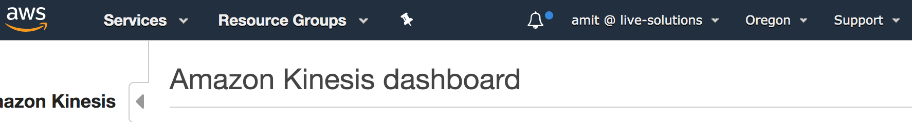
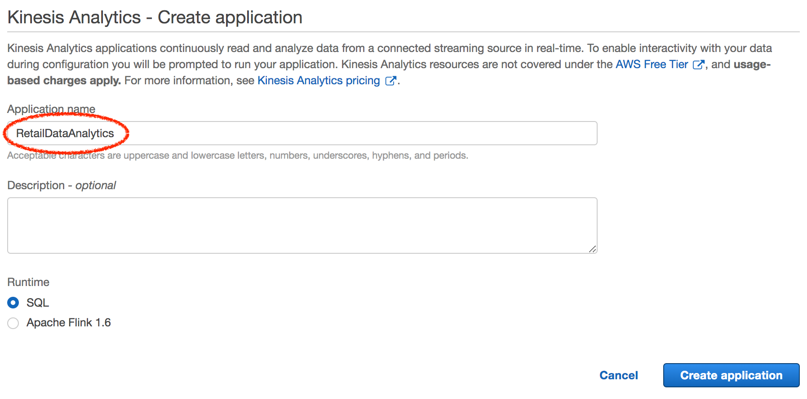
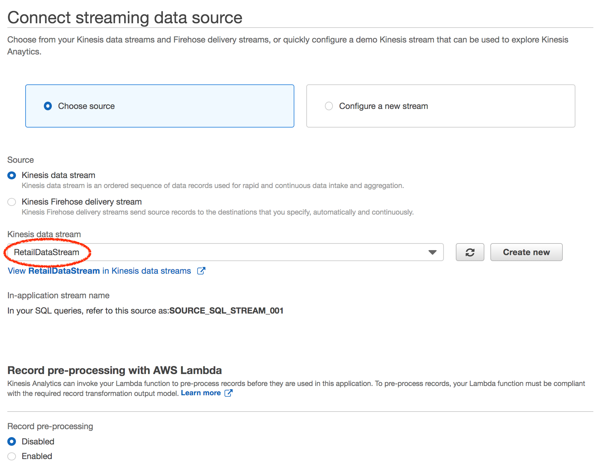
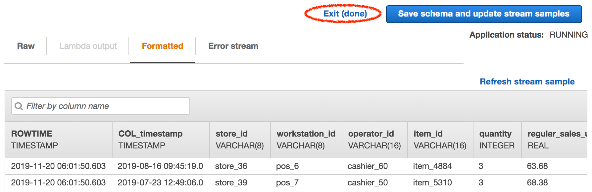
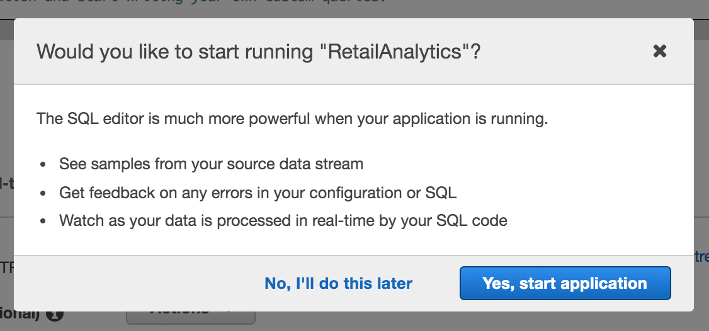
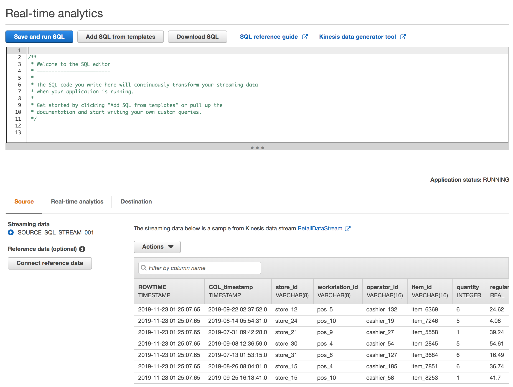

# Lab 1 -- Ingest and Detect Anomalies

In this lab, we will generate simulated POS data that we will ingest as it happens. We will also process this data in near real-time and detect anomalies on the fly. And finally, we will store this data, along with the generated anomaly scores and associated explanations (*why a value was considered anomalous along with attribution scores that show which specific column caused it to be flagged as an anomaly*) for our records and historic analysis.

## Sample Data

COL_timestamp | store\_id | workstation\_id | operator\_id | item\_id | quantity | regular\_sales\_unit\_price | retail\_price\_modifier | retail\_kpi\_metric
--------------|-----------|-----------------|--------------|----------|----------|-----------------------------|-----------------------|------------------------
2019-08-31T10:40:05.0 | store_36 | pos_2  | cashier_75  | item_1098 | 5 | 64.42 | 5.83 | 87  
2019-09-27T17:12:33.0 | store_43 | pos_10 | cashier_175 | item_4159 | 5 | 50.25 | 7.68 | 85
...                   |          |        |             |           |   |       |      |


## Console / GUI

To ingest data, we'll first set up an Amazon Kinesis Data Stream to which we can send our generated data. To set this up:

### Step A - Create Kinesis Data Stream

1. Point browser to https://console.aws.amazon.com/kinesis

   Note the region that you are defaulted to, which in the case of the screenshot below is 'Oregon'. While you are free to choose any supported region you prefer, we strongly recommend choosing Oregon for the purposes of this workshop.
   
   

2. Create a Kinesis Data Stream. Give a descriptive name for 'Kinesis stream name' (note the restrictions in what characters can be used for the name right below the textbox).

   
   
3. Click 'Create Kinesis Streams'. This will take a few 10 seconds after which, the Kinesis Data Stream should have been created. You should see a success message like this:

   


### Step B - Run Script to Generate Data

Since we've created the Kinesis Data Stream to which we can send data to, we'll start running our simulation script that generates the PoS data and send that to stream.

To run, switch to the CLI and execute:

```shell
ruby gen_pos_log_stream.rb
```

Wait for the script to start running and then switch back to the AWS console and continue with the steps below.


### Step C - Create Kinesis Analytics SQL App

We will now create a Kinesis Analytics SQL App that we will connect to the above Kinesis Data Stream to allow us to *process* the data we ingest.

1. Now click on 'Data Analytics' in the left hand tab.

      
   
2. Create Kinesis Analytics SQL App

       
   
3. Connect streaming data. Click on 'Connect streaming data'

   
   
4. Choose the data stream

      
   
5. Scroll down until you see this and click on 'Discover schema'

      
   
6. Now look at the discovered schema -- the column names and the associated data types. If you look carefully, you'll see that Kinesis Data Analytics has automatically discovered most of the schema types correctly *except* one -- the very first column, ```COL_timestamp```. This column has been classified as ```VARCHAR``` instead of ```TIMESTAMP```. (We deliberately introduced an uncommon ```TIMESTAMP``` format to force this). However, these situations this is easy to fix.

   
   
7. To fix the schema, click on the 'Edit schema' button. Against ```COL_timestamp``` (the first under 'Column name'), click on the drop-down and choose ```TIMESTAMP``` as the 'Column type' instead.
   
   
   
8. Click on 'Save schema and update stream samples'. This will take a few 10s, but once complete, and the stream samples are updated, scroll down and you will notice the corrected schema as shown:

      
   
9. Click on 'Exit (done)' to exit the screen

   
   

### Step D

In this step, we'll configure the Kinesis Data Analytics SQL to process the data, that we're now ingesting, on the fly.

1. Click on 'Go to SQL editor'

   
   
2. If you see an ensuing dialog box, click 'Yes, start application'. This will take at least a few 10s of seconds, after raw data will start streaming in.

      
   
3. After the Kinesis Data Analytics application starts up successfully, you should see the data start to stream in.

   
   

### Step E

Here, we'll add some streaming SQL to process ingested PoS data on the fly.
 
1. Copy the streaming SQL from the file ```retail_pos_analytics.sql``` into the SQL editor window. The SQL is also provided here for convenience

   ```sql
   CREATE OR REPLACE STREAM "RETAIL_KPI_ANOMALY_DETECTION_STREAM" (
  "store_id"              varchar(8),
  "workstation_id"        varchar(8),
  "operator_id"           varchar(16),
  "item_id"               varchar(16),
  "retail_kpi_metric"     integer,
  "ANOMALY_SCORE"         double,
  "ANOMALY_EXPLANATION"   varchar(512)
);

    -- Compute an anomaly score for each record in the input stream
    CREATE OR REPLACE PUMP "RETAIL_KPI_ANOMALY_DETECTION_STREAM_PUMP" AS
    INSERT INTO "RETAIL_KPI_ANOMALY_DETECTION_STREAM"
      SELECT STREAM "store_id",
                    "workstation_id",
                    "operator_id",
                    "item_id",
                    "retail_kpi_metric",
                    ANOMALY_SCORE,
                    ANOMALY_EXPLANATION
      FROM TABLE(RANDOM_CUT_FOREST_WITH_EXPLANATION (
                     CURSOR( SELECT STREAM "store_id",
                                            "workstation_id",
                                            "operator_id",
                                            "item_id",
                                            "retail_kpi_metric"
                             FROM "SOURCE_SQL_STREAM_001"), 100, 256, 100000, 1, false)
      );
    
    
    CREATE OR REPLACE STREAM "DESTINATION_STREAM" (
      "COL_timestamp"               timestamp,
      "store_id"                    varchar(8),
      "workstation_id"              varchar(8),
      "operator_id"                 varchar(16),
      "item_id"                     varchar(16),
      "quantity"                    integer,
      "regular_sales_unit_price"    real,
      "retail_price_modifier"       real,
      "retail_kpi_metric"           integer,
      "ANOMALY_SCORE"               double,
      "ANOMALY_EXPLANATION"         varchar(512)
    );
    
    CREATE OR REPLACE PUMP "DESTINATION_STREAM_PUMP" AS
    INSERT INTO "DESTINATION_STREAM"
      SELECT STREAM "SOURCE_STREAM"."COL_timestamp",
                    "SOURCE_STREAM"."store_id",
                    "SOURCE_STREAM"."workstation_id",
                    "SOURCE_STREAM"."operator_id",
                    "SOURCE_STREAM"."item_id",
                    "SOURCE_STREAM"."quantity",
                    "SOURCE_STREAM"."regular_sales_unit_price",
                    "SOURCE_STREAM"."retail_price_modifier",
                    "SOURCE_STREAM"."retail_kpi_metric",
                    "ANOMALY_STREAM"."ANOMALY_SCORE",
                    "ANOMALY_STREAM"."ANOMALY_EXPLANATION"
      FROM "SOURCE_SQL_STREAM_001" AS "SOURCE_STREAM"
      JOIN "RETAIL_KPI_ANOMALY_DETECTION_STREAM" AS "ANOMALY_STREAM"
        ON  "SOURCE_STREAM"."store_id"       = "ANOMALY_STREAM"."store_id"
        AND "SOURCE_STREAM"."workstation_id" = "ANOMALY_STREAM"."workstation_id"
        AND "SOURCE_STREAM"."operator_id"    = "ANOMALY_STREAM"."operator_id"
        AND "SOURCE_STREAM"."item_id"        = "ANOMALY_STREAM"."item_id";
   
   ```

   Paste the above SQL into the SQL editor window:
   
   
   
2. Click on 'Save and run SQL'. 

3. You will need to wait for a few 10 seconds for the results to start streaming. Once the results start streaming in, under the 'Real-time analytics' tab, you will notice multiple streams. 

   The ```RETAIL_KPI_ANOMALY_DETECTION_STREAM``` is the result of the 

   See the docs here for a more detailed explanation: https://docs.aws.amazon.com/kinesisanalytics/latest/dev/streaming-sql-concepts.html

   | TODO: Explain the anomaly detection part |
| --- |   

3. Update the streaming SQL.

   | TODO: Include all 3 columns and re-run SQL |
| --- |


---

<style>
    img {
        box-shadow:inset 0 1px 0 rgba(255,255,255,.6), 0 16px 30px 7px rgba(0,0,0,0.56), 0 0 0 0 rgba(0, 0, 0, 0.3);
        padding: 3px 5px;
        margin: 18px 0 44px;
        text-align: center;
        max-width: 80%;
        display: block;
        margin-left: auto;
        margin-right: auto;
    }
    
    table {
        overflow: auto;
        display: block;
    }
</style>


