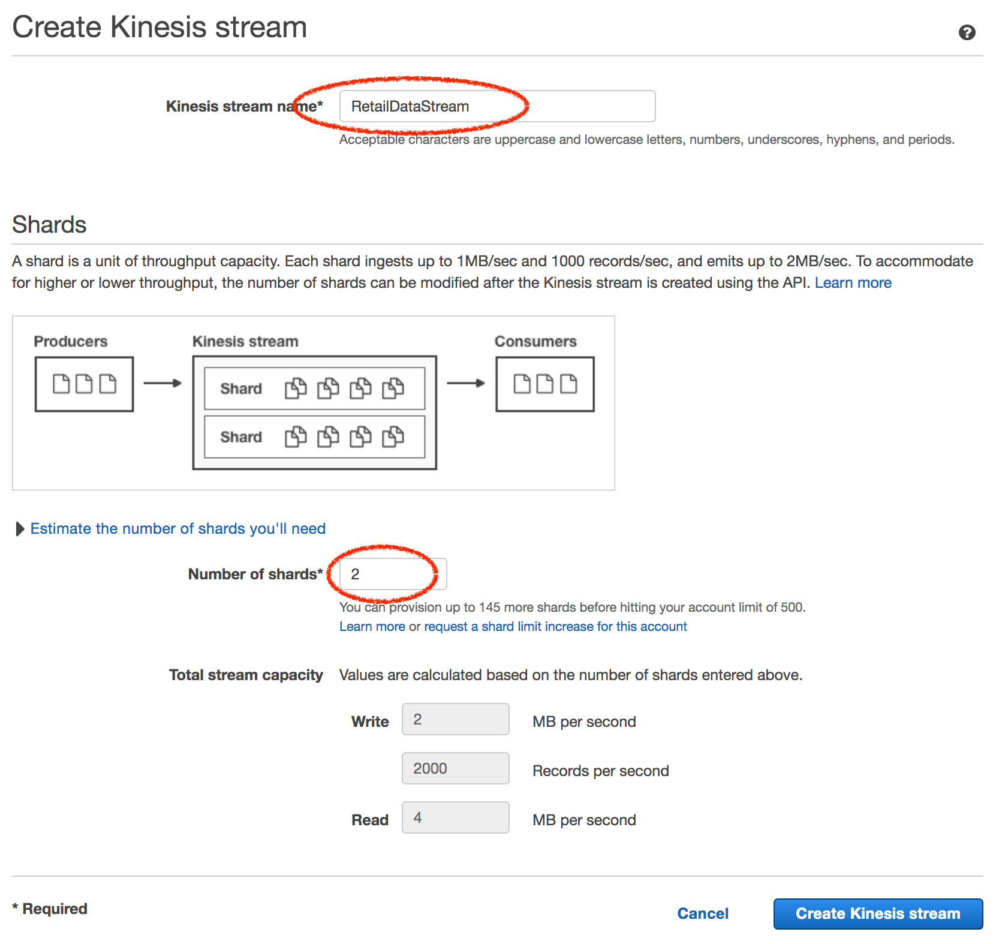
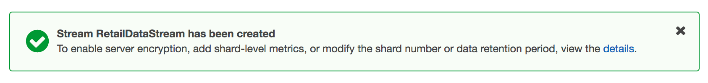
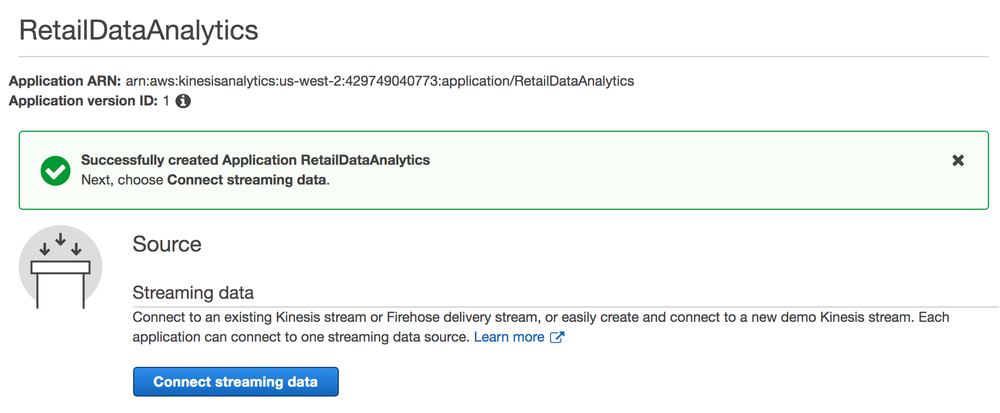
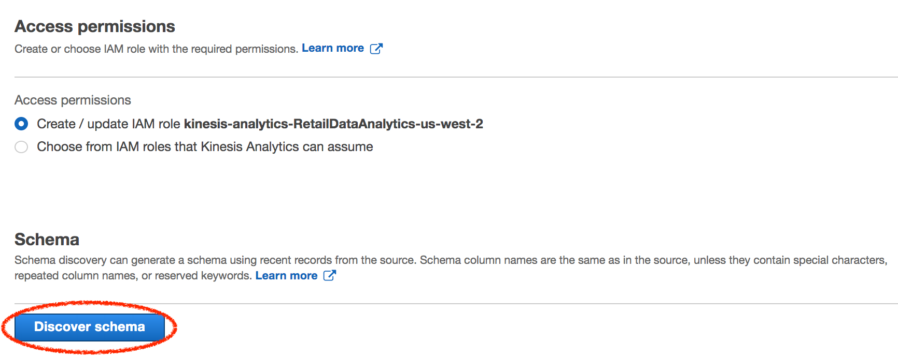
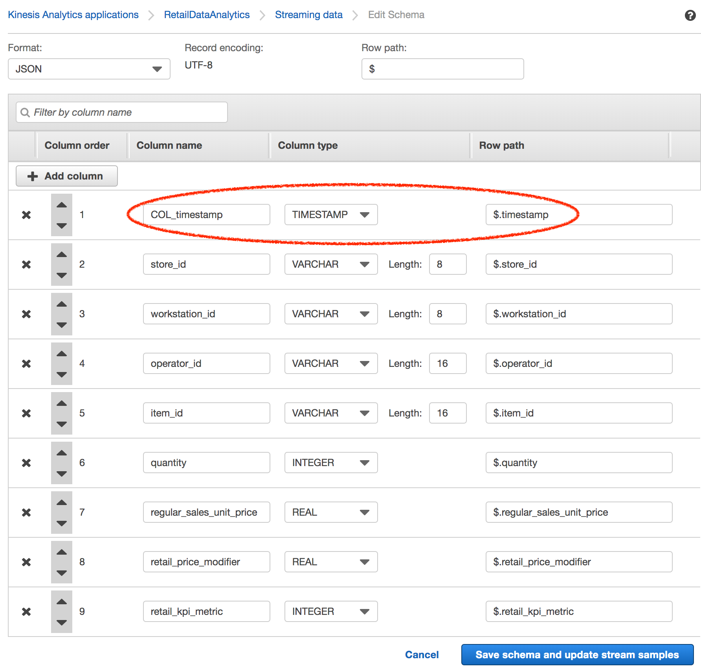
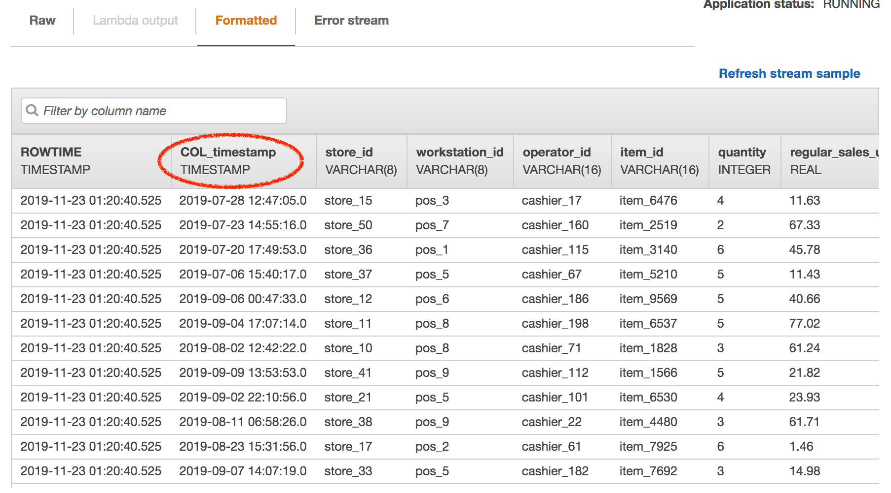
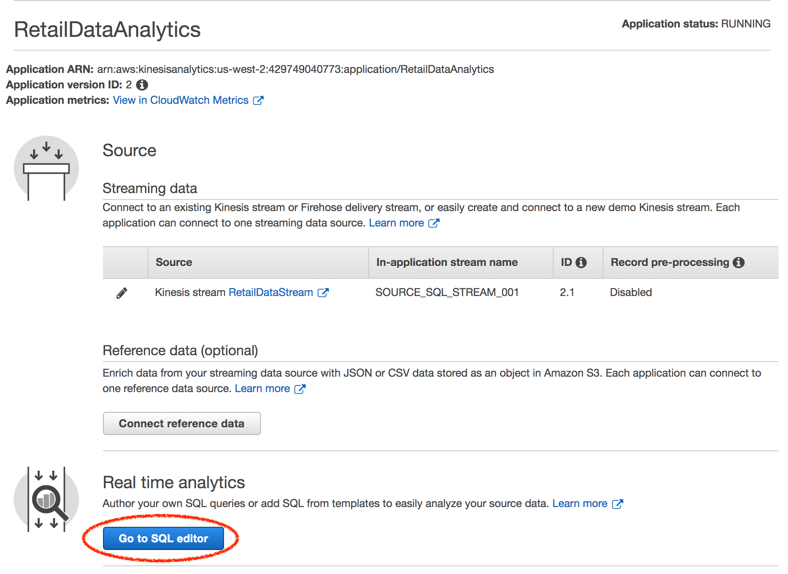
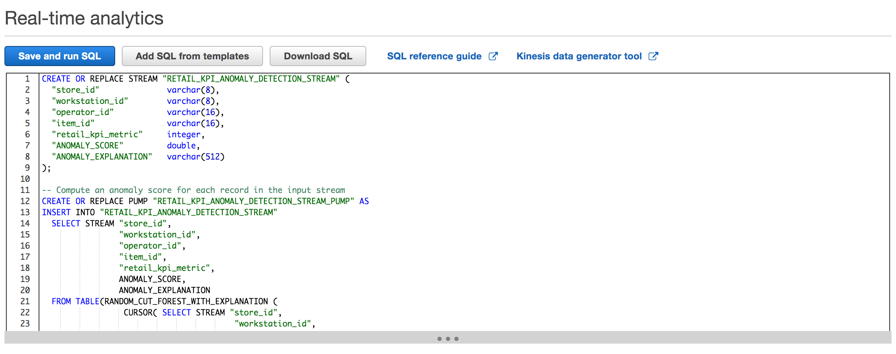

# Lab 1 -- Ingest and Detect Anomalies

In this lab, we will generate simulated POS data that we will ingest as it happens. We will also process this data in near real-time and detect anomalies on the fly. And finally, we will store this data, along with the generated anomaly scores and associated explanations (*why a value was considered anomalous along with attribution scores that show which specific column caused it to be flagged as an anomaly*) for our records and historic analysis.

## Sample Data

COL_timestamp | store\_id | workstation\_id | operator\_id | item\_id | quantity | regular\_sales\_unit\_price | retail\_price\_modifier | retail\_kpi\_metric
--------------|-----------|-----------------|--------------|----------|----------|-----------------------------|-----------------------|------------------------
2019-08-31T10:40:05.0 | store_36 | pos_2  | cashier_75  | item_1098 | 5 | 64.42 | 5.83 | 87  
2019-09-27T17:12:33.0 | store_43 | pos_10 | cashier_175 | item_4159 | 5 | 50.25 | 7.68 | 85
...                   |          |        |             |           |   |       |      |


## Console / GUI

To ingest data, we'll first set up an Amazon Kinesis Data Stream to which we can send our generated data. To set this up:

### Step A - Create Kinesis Data Stream

1. Point browser to https://console.aws.amazon.com/kinesis

   Note the region that you are defaulted to, which in the case of the screenshot below is 'Oregon'. While you are free to choose any supported region you prefer, we strongly recommend choosing Oregon for the purposes of this workshop.
   
   
   
1. Click on 'Get Started'

   
   
1. Click on 'Create data stream'

      

2. For 'Kinesis stream name', give it a descriptive name such as 'RetailDataStream' for example. (note the restrictions in what characters can be used for the name right below the textbox).

   **Note:** You're free to name this stream anything you prefer, but if you change it, be sure to also change line no. 5 in the ```gen_pos_log_stream.rb``` script in the ```/src``` directory and use the same name for ```STREAM_NAME```
   
   ```
   STREAM_NAME = 'RetailDataStream'
   ```

3. For 'Number of shards*' enter '2'

   
   
3. Click 'Create Kinesis Streams'. This will take a few 10 seconds after which, the Kinesis Data Stream should have been created. You should see a success message like this:

   
   
   We have successfully created a Amazon Kinesis Stream resource that can ingest our data.


### Step B - Run Script to Generate Data

Since we've created the Kinesis Data Stream to which we can send data to, we'll start running our simulation script that generates the PoS data and send that data to the stream that we just created.

To run this script, switch to the browser tab where you have the Cloud9 IDE open. Go to the Cloud9 IDE terminal and from the root workshop directory ```/retail``` run:

```shell
cd lab1_ingest_and_detect_anomalies/src
```

```shell
gem install bundler
```

```shell
bundle install
```

```shell
mkdir config
cd config
touch aws.yml
```

Replace ```ACCESS_KEY_ID``` and ```SECRET_ACCESS_KEY``` with what you copied into your notepad at the beginning and then run:

```shell
echo "access_key_id: [ACCESS_KEY_ID]" >> aws.yml
echo "secret_access_key: [SECRET_ACCESS_KEY]" >> aws.yml
```

```shell
cd ..
```

Then execute the script

```shell
ruby gen_pos_log_stream.rb
```

Wait for the script to start running and then switch back to the AWS console to continue with the steps below.


### Step C - Create Kinesis Data Analytics 

We will now create an Amazon Kinesis Data Analytics App (SQL-based) that we will connect to the above Kinesis Data Stream to allow us to *process* the data we are ingesting.

1. Click on 'Data Analytics' in the left hand tab. 
   
      

2. You may see either the screen above or the one below, depending on whether or not you have already created an analytics app in the past.

   Click on 'Create Kinesis stream' or 'Create application' depending on the screen.

   
   
   
   
2. For 'Application name', enter something descriptive. The 'Description' is optional. Leave the rest of the options as-is.

3. Then click on 'Create application'

       
   
3. Click on 'Connect streaming data' to connect the Kinesis Data Stream we created in Step A with the Kinesis Data Analytics application.

   
   
4. For the 'Kinesis data stream' drop-down, choose the Kinesis Data Stream name that we just created 

      
   
5. Scroll down until you see this and click on 'Discover schema'

      
   
6. Now look at the discovered schema, the column names, and associated data types. You'll notice that Kinesis Data Analytics has automatically discovered most of the schema types correctly. *Except* one. The very first column, ```COL_timestamp``` has been classified as ```VARCHAR``` instead of ```TIMESTAMP```. We deliberately introduced an uncommon ```TIMESTAMP``` format to trip it. However, this is easy to fix.
   
7. To fix the schema, click on the 'Edit schema' button. 

   

7. Update ```COL_timestamp```'s 'Column type' value to ```TIMESTAMP``` from the drop-down options.
   
   
   
8. Click on 'Save schema and update stream samples'. This will take a few 10s, but once complete, and the stream samples are updated, scroll down and you will notice the corrected schema as shown:

      
   
9. Click on 'Exit (done)' to exit the screen

   
   

### Step D

In this step, we'll configure the Kinesis Data Analytics SQL to process the data, that we're now ingesting, on the fly.

1. Click on 'Go to SQL editor'

   
      
2. After the Kinesis Data Analytics application starts up successfully, you should see the data start to stream in.

   
   

### Step E

Here, we'll add some streaming SQL to process ingested PoS data on the fly. We'll experiment with two different streaming SQL statements
  
 
1. For our first experiment, copy the streaming SQL from the file ```retail_pos_analytics_kpi_attribution.sql``` into the SQL editor window. The SQL is also provided here for convenience

   ```sql
    --
    -- Creates a stream with a subset of the data that we are ingesting,
    -- which is our way of ensuring that we only run anomaly detection on
    -- the numeric columns that we pick.
    --
    CREATE OR REPLACE STREAM "RETAIL_KPI_ANOMALY_DETECTION_STREAM" (
      "store_id"              varchar(8),
      "workstation_id"        varchar(8),
      "operator_id"           varchar(16),
      "item_id"               varchar(16),
      "retail_kpi_metric"     integer,
      "ANOMALY_SCORE"         double,
      "ANOMALY_EXPLANATION"   varchar(512)
    );
    
    --
    -- Compute an anomaly score for each record in the input stream. The
    -- anomaly detection algorithm considers ALL numeric columns and
    -- ignores the rest.
    --
    CREATE OR REPLACE PUMP "RETAIL_KPI_ANOMALY_DETECTION_STREAM_PUMP" AS
    INSERT INTO "RETAIL_KPI_ANOMALY_DETECTION_STREAM"
      SELECT STREAM "store_id",
                    "workstation_id",
                    "operator_id",
                    "item_id",
                    "retail_kpi_metric",
                    ANOMALY_SCORE,
                    ANOMALY_EXPLANATION
      FROM TABLE(RANDOM_CUT_FOREST_WITH_EXPLANATION (
                     CURSOR( SELECT STREAM "store_id",
                                            "workstation_id",
                                            "operator_id",
                                            "item_id",
                                            "retail_kpi_metric"
                             FROM "SOURCE_SQL_STREAM_001"), 100, 256, 100000, 1, false)
      );
    
    --
    -- Create a destination stream that combines (JOINs) all the values in
    -- the source stream along with the anomaly values in the anomaly stream
    -- which we will then store for historic records.
    --
    CREATE OR REPLACE STREAM "DESTINATION_STREAM" (
      "COL_timestamp"               timestamp,
      "store_id"                    varchar(8),
      "workstation_id"              varchar(8),
      "operator_id"                 varchar(16),
      "item_id"                     varchar(16),
      "quantity"                    integer,
      "regular_sales_unit_price"    real,
      "retail_price_modifier"       real,
      "retail_kpi_metric"           integer,
      "ANOMALY_SCORE"               double
      --"ANOMALY_EXPLANATION"         varchar(512)
    );
    
    CREATE OR REPLACE PUMP "DESTINATION_STREAM_PUMP" AS
    INSERT INTO "DESTINATION_STREAM"
      SELECT STREAM "SOURCE_STREAM"."COL_timestamp",
                    "SOURCE_STREAM"."store_id",
                    "SOURCE_STREAM"."workstation_id",
                    "SOURCE_STREAM"."operator_id",
                    "SOURCE_STREAM"."item_id",
                    "SOURCE_STREAM"."quantity",
                    "SOURCE_STREAM"."regular_sales_unit_price",
                    "SOURCE_STREAM"."retail_price_modifier",
                    "SOURCE_STREAM"."retail_kpi_metric",
                    "ANOMALY_STREAM"."ANOMALY_SCORE"
                    --"ANOMALY_STREAM"."ANOMALY_EXPLANATION"
      FROM "SOURCE_SQL_STREAM_001" AS "SOURCE_STREAM"
      JOIN "RETAIL_KPI_ANOMALY_DETECTION_STREAM" AS "ANOMALY_STREAM"
        ON  "SOURCE_STREAM"."store_id"       = "ANOMALY_STREAM"."store_id"
        AND "SOURCE_STREAM"."workstation_id" = "ANOMALY_STREAM"."workstation_id"
        AND "SOURCE_STREAM"."operator_id"    = "ANOMALY_STREAM"."operator_id"
        AND "SOURCE_STREAM"."item_id"        = "ANOMALY_STREAM"."item_id";

   ```

   Paste the above SQL into the SQL editor window.
   
   
2. Click on 'Save and run SQL' button. 

   
   
   You will need to wait for a few 10 seconds for the results to start streaming. While waiting for this to update...
   
         
   | Useful terms: It might also be helpful to understand the simple concepts of a STREAM and a PUMP. |
| --- | 
   
   **STREAM**: An *in-application* stream works like a table that you can query using SQL statements, but it's called a stream because it represents continuous data flow.
   
   **PUMP**: A pump is a continuously running insert query that inserts data from one *in-application* stream to another *in-application* stream.
   
   See the docs here for a more detailed explanation: https://docs.aws.amazon.com/kinesisanalytics/latest/dev/streaming-sql-concepts.html


3. Once the results start streaming in, under the 'Real-time analytics' tab, you will notice multiple streams. 
   
   1. ```SOURCE_SQL_STREAM_001``` - raw source data
   2. ```RETAIL_KPI_ANOMALY_DETECTION_STREAM``` - stream anomaly scores
   3. ```DESTINATION_STREAM``` - raw source data ```JOIN```ed with anomaly scores to store in Amazon S3 for historical analysis.
   
4. Under 'In-application streams' click on the ```RETAIL_KPI_ANOMALY_DETECTION_STREAM``` and wait a seconds for the data to start flowing.

   


5. Scroll to the right until you reach the ```ANOMALY_SCORE``` column. 

   | Results Explained: You'll notice floating point values. What these values mean are that, the algorithm considers records with higher ```ANOMALY_SCORE```s as *more anomalous*. |
| --- | 

   

6. Look further to the right of this and you'll see the ```ANOMALY_EXPLANATION``` column adjacent to it. Notice the values in this (JSON formatted) column. 

   | Results Explained: In the ```ANOMALY_EXPLANATION``` column, you'll see ```retail_kpi_metric``` being called out with an associated ```ATTRIBUTION_SCORE```. This is the algorithms's way of indicatiing the extent to which this column contributed to the anomaly score. |
| --- |   
   
      

### Step F

Now we'll slightly modify the above streaming SQL and compare the results.

1. Now copy the streaming SQL in ```retail_pos_analytics_multicolumn_attributions.sql``` into the same SQL Editor as you did before. The SQL statements are also included below for convenience.

   ```sql
    CREATE OR REPLACE STREAM "RETAIL_KPI_ANOMALY_DETECTION_STREAM" (
      "store_id"                    varchar(8),
      "workstation_id"              varchar(8),
      "operator_id"                 varchar(16),
      "item_id"                     varchar(16),
      "quantity"                    integer,
      "regular_sales_unit_price"    real,
      "retail_price_modifier"       real,
      "retail_kpi_metric"           integer,
      "ANOMALY_SCORE"               double,
      "ANOMALY_EXPLANATION"         varchar(512)
    );
    
    -- Compute an anomaly score for each record in the input stream
    CREATE OR REPLACE PUMP "RETAIL_KPI_ANOMALY_DETECTION_STREAM_PUMP" AS
    INSERT INTO "RETAIL_KPI_ANOMALY_DETECTION_STREAM"
      SELECT STREAM "store_id",
                    "workstation_id",
                    "operator_id",
                    "item_id",
                    "quantity",
                    "regular_sales_unit_price",
                    "retail_price_modifier",
                    "retail_kpi_metric",
                    ANOMALY_SCORE,
                    ANOMALY_EXPLANATION
      FROM TABLE(RANDOM_CUT_FOREST_WITH_EXPLANATION (
                     CURSOR( SELECT STREAM "store_id",
                                           "workstation_id",
                                           "operator_id",
                                           "item_id",
                                           "quantity",
                                           "regular_sales_unit_price",
                                           "retail_price_modifier",
                                           "retail_kpi_metric"
                             FROM "SOURCE_SQL_STREAM_001"), 100, 256, 100000, 1, false)
      );
    
    
    CREATE OR REPLACE STREAM "DESTINATION_STREAM" (
      "COL_timestamp"               timestamp,
      "store_id"                    varchar(8),
      "workstation_id"              varchar(8),
      "operator_id"                 varchar(16),
      "item_id"                     varchar(16),
      "quantity"                    integer,
      "regular_sales_unit_price"    real,
      "retail_price_modifier"       real,
      "retail_kpi_metric"           integer,
      "ANOMALY_SCORE"               double
      -- "ANOMALY_EXPLANATION"         varchar(512),
    );
    
    CREATE OR REPLACE PUMP "DESTINATION_STREAM_PUMP" AS
    INSERT INTO "DESTINATION_STREAM"
      SELECT STREAM "SOURCE_STREAM"."COL_timestamp",
        "SOURCE_STREAM"."store_id",
        "SOURCE_STREAM"."workstation_id",
        "SOURCE_STREAM"."operator_id",
        "SOURCE_STREAM"."item_id",
        "SOURCE_STREAM"."quantity",
        "SOURCE_STREAM"."regular_sales_unit_price",
        "SOURCE_STREAM"."retail_price_modifier",
        "SOURCE_STREAM"."retail_kpi_metric",
        "ANOMALY_STREAM"."ANOMALY_SCORE"
      -- "ANOMALY_STREAM"."ANOMALY_EXPLANATION"
      FROM "SOURCE_SQL_STREAM_001" AS "SOURCE_STREAM"
        JOIN "RETAIL_KPI_ANOMALY_DETECTION_STREAM" AS "ANOMALY_STREAM"
          ON  "SOURCE_STREAM"."store_id"       = "ANOMALY_STREAM"."store_id"
              AND "SOURCE_STREAM"."workstation_id" = "ANOMALY_STREAM"."workstation_id"
              AND "SOURCE_STREAM"."operator_id"    = "ANOMALY_STREAM"."operator_id"
              AND "SOURCE_STREAM"."item_id"        = "ANOMALY_STREAM"."item_id";

   ```
   
   
   
2. Click on 'Save and run SQL' and wait for the analytics application to update the stream.

3. Once the data starts flowing, click on the ```RETAIL_KPI_ANOMALY_DETECTION_STREAM``` and wait a seconds for the data to start flowing again.

   


4. Now scroll again all the way to the right until you see the ```ANOMALY_SCORE``` and ```ANOMALY_EXPLANATION``` columns. Notice more values in the ```ANOMALY_EXPLANATION``` column than before?

   | Results Explained: In the ```ANOMALY_EXPLANATION``` column, this time, you'll notice the presence of ```quantity```,```retail_price_modifier```, and ```regular_sales_unit_price```, in addition to ```retail_kpi_metric```. The algorithm is now using all of these numeric values to determine the anomaly score of a record. So, you get to cherry pick the values that you think are most relevant and want the algorithm to score. |
| --- |   

### Recap

To Recap, we 

* Created an Amazon Kinesis Data stream to ingest large volumes of data
* Ran a simulation script to generate PoS data and send to Kinesis
* Created an Amazon Kinesis Analytics application to receive data from the Kinesis Data stream and detect anomalies

Before jumping into Lab 2, now would be a good time to jump back to Lab 3 and check up on Amazon Forecast predictor training, which should be done.

Switch over to Lab 3 and continue from Step E to generate forecasts.

---

<style>
    img {
        box-shadow:inset 0 1px 0 rgba(255,255,255,.6), 0 16px 30px 7px rgba(0,0,0,0.56), 0 0 0 0 rgba(0, 0, 0, 0.3);
        padding: 3px 5px;
        margin: 18px 0 44px;
        text-align: center;
        max-width: 80%;
        display: block;
        margin-left: auto;
        margin-right: auto;
    }
    
    table {
        overflow: auto;
        display: block;
    }
</style>


