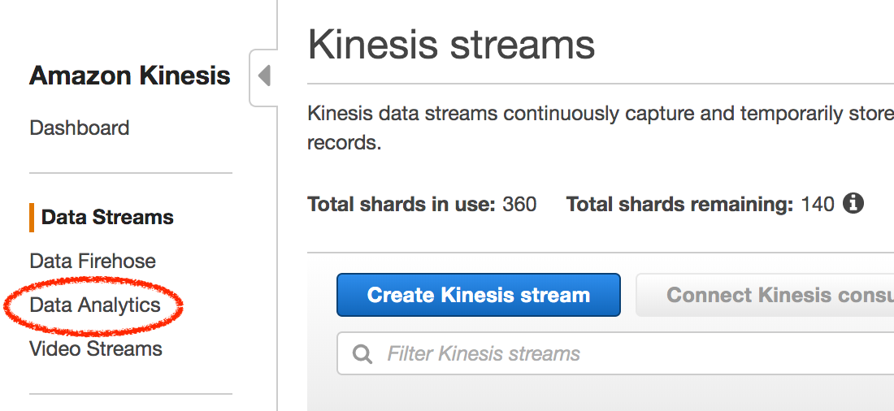

# Lab 1 -- Ingest and Process

In this lab, we will 

## Sample Data

COL_timestamp | store\_id | workstation\_id | operator\_id | item\_id | quantity | regular\_sales\_unit\_price | retail\_price\_modifier | retail\_kpi\_metric
--------------|-----------|-----------------|--------------|----------|----------|-----------------------------|-----------------------|------------------------
2019-08-31T10:40:05.0 | store_36 | pos_2  | cashier_75  | item_1098 | 5 | 64.42 | 5.83 | 87  
2019-09-27T17:12:33.0 | store_43 | pos_10 | cashier_175 | item_4159 | 5 | 50.25 | 7.68 | 85
...                   |          |        |             |           |   |       |      |

## Ingest

Run the app

## Process

### Step A

1. Point browser to https://

2. Create Streams

   
   
3. Click 'Create Kinesis Streams'

4. Click on 'Data Analytics' in the left hand tab

      
   
5.    

---

