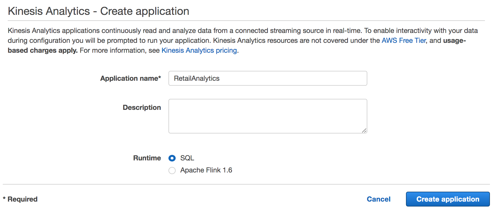
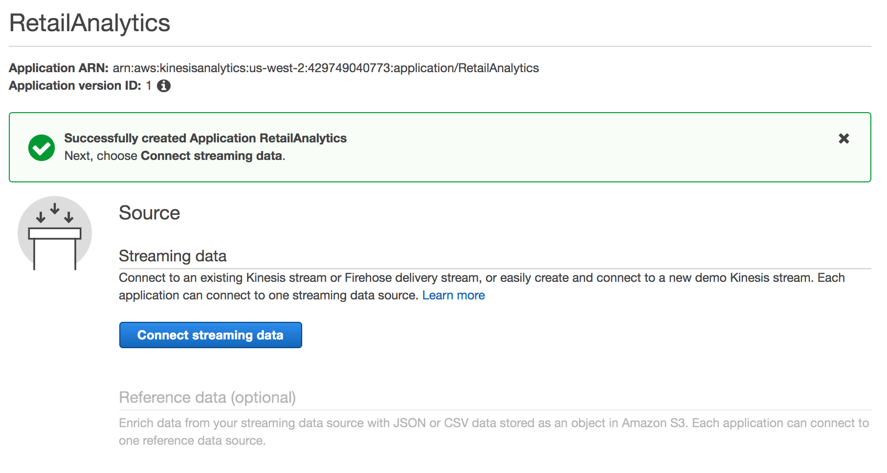
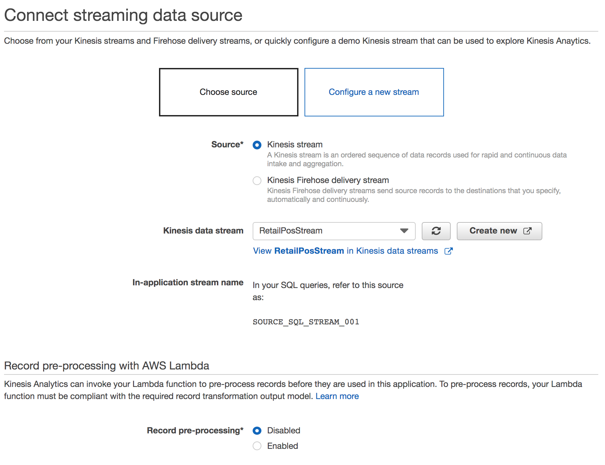
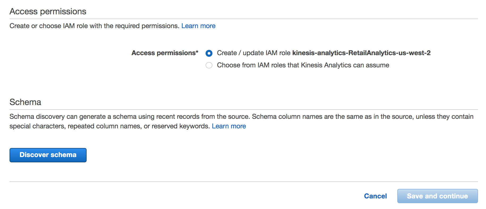
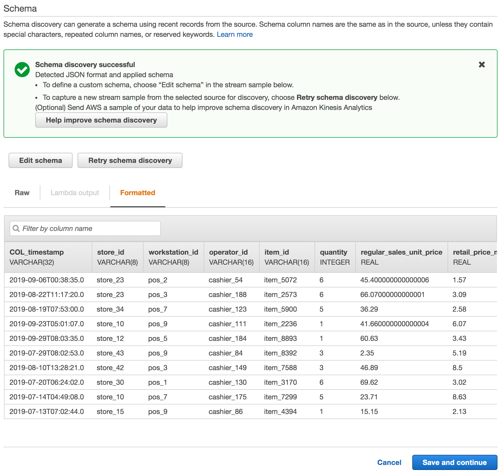
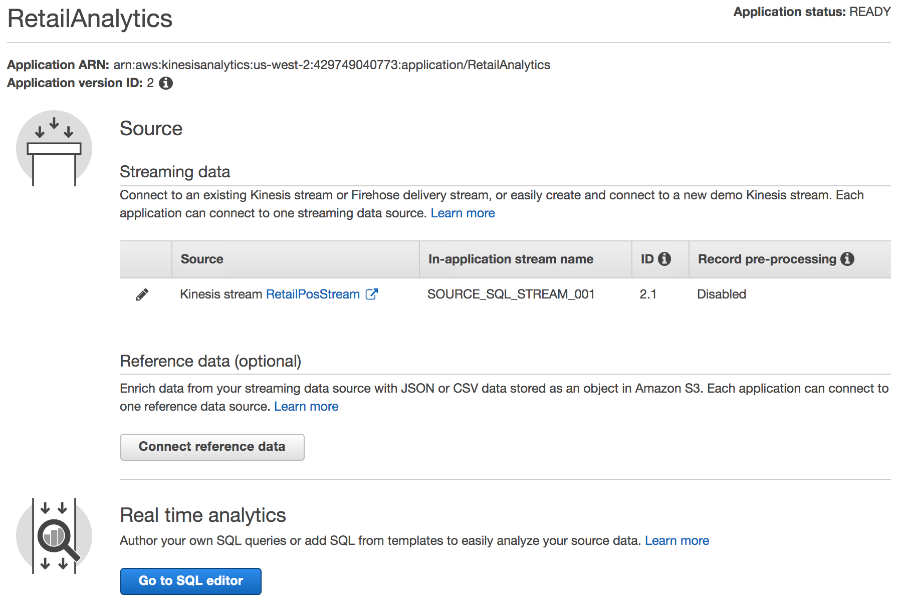
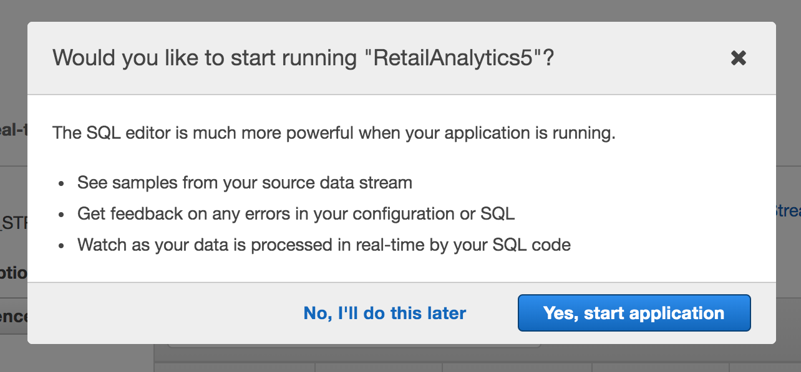
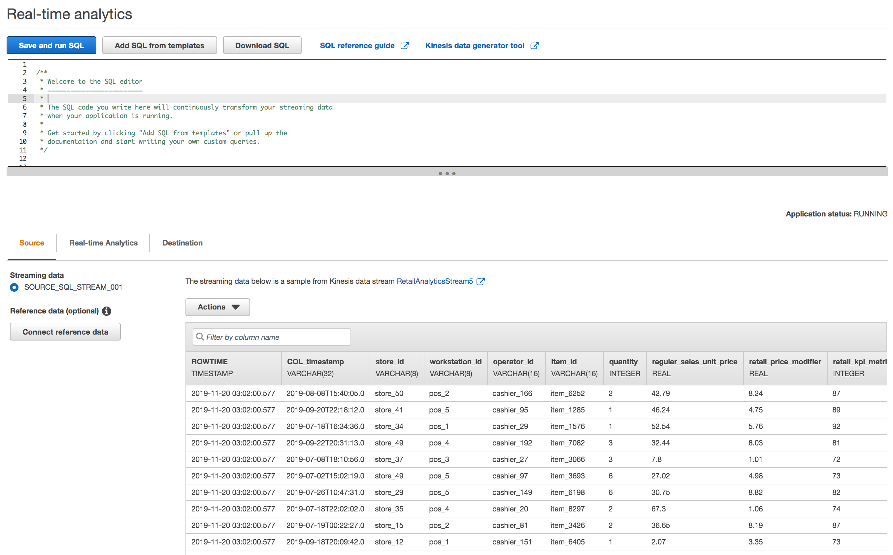

# Lab 1 -- Ingest, Process, and Store Data

In this lab, we will generate simulated POS data that we will ingest as it happens. We will also process this data in near real-time and detect anomalies on the fly. And finally, we will store this data, along with the generated anomaly scores and associated explanations (*why a value was considered anomalous along with attribution scores that show which specific column caused it to be flagged as an anomaly*) for our records and historic analysis.

## Sample Data

COL_timestamp | store\_id | workstation\_id | operator\_id | item\_id | quantity | regular\_sales\_unit\_price | retail\_price\_modifier | retail\_kpi\_metric
--------------|-----------|-----------------|--------------|----------|----------|-----------------------------|-----------------------|------------------------
2019-08-31T10:40:05.0 | store_36 | pos_2  | cashier_75  | item_1098 | 5 | 64.42 | 5.83 | 87  
2019-09-27T17:12:33.0 | store_43 | pos_10 | cashier_175 | item_4159 | 5 | 50.25 | 7.68 | 85
...                   |          |        |             |           |   |       |      |


## Console / GUI

To ingest data, we'll first set up an Amazon Kinesis Data Stream to which we can send our generated data. To set this up:

### Step A

1. Point browser to https://console.aws.amazon.com/kinesis

   Note the region that you are defaulted to, which in the case of the screenshot below is 'Oregon'. While you are free to choose any supported region you prefer, we strongly recommend choosing Oregon for the purposes of this workshop.
   
   

2. Create a Kinesis Data Stream. Give a descriptive name for 'Kinesis stream name' (note the restrictions in what characters can be used for the name right below the textbox).

   
   
3. Click 'Create Kinesis Streams'. This will take a few 10 seconds after which, the Kinesis Data Stream should have been created.

#### Step B

We will now create a Kinesis Analytics SQL App that we will connect to the above Kinesis Data Stream to allow us to *process* the data we ingest.

1. Now click on 'Data Analytics' in the left hand tab.

      
   
2. Create Kinesis Analytics SQL App

       
   
3. Connect streaming data. Click on 'Connect streaming data'

   
   
4. Choose the data stream

      
   
5. Scroll down until you see this and click on 'Discover schema'

      
   
6. Discover Schema. 

   
   
7. Click on 'Save and continue'   
      

#### Step C

Since we've created the Kinesis Data Stream to which we can send data to, we'll start running our simulation script that generates the PoS data and send that to stream.

To run, switch to the CLI and execute:

```shell
ruby gen_pos_log_stream.rb
```

Wait for the script to start running and then switch back to the AWS console and continue with the steps below.


#### Step D

In this step, we'll configure the Kinesis Data Analytics SQL to process the data, that we're now ingesting, on the fly.

1. Click on 'Go to SQL editor'

   
   
2. In the ensuing dialog box, click 'Yes, start application'. This will take about 30-90 seconds, after which we can edit the SQL.

      
   
3. After the Kinesis Data Analytics application starts up successfully, you should see the data start to stream in.

   
   
   

---

<style>
    img {
        box-shadow:inset 0 1px 0 rgba(255,255,255,.6), 0 16px 30px 7px rgba(0,0,0,0.56), 0 0 0 0 rgba(0, 0, 0, 0.3);
        padding: 3px 5px;
        margin: 18px 0 44px;
        text-align: center;
        max-width: 80%;
        display: block;
        margin-left: auto;
        margin-right: auto;
    }
    
    table {
        overflow: auto;
        display: block;
    }
</style>


