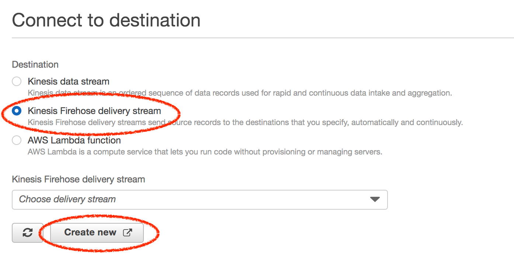
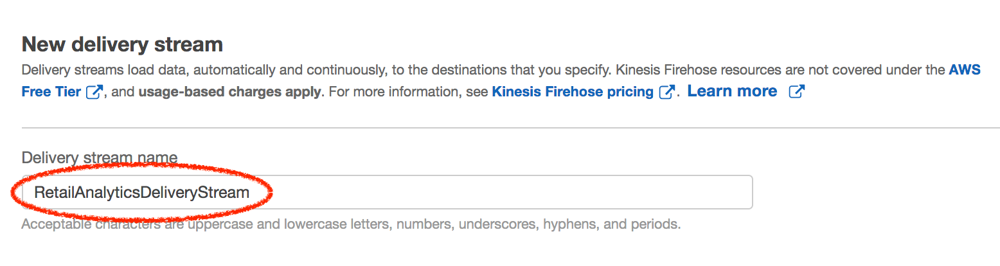
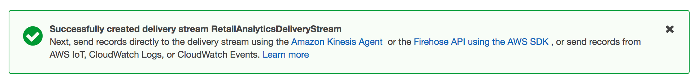

# Lab 2 - Store & Analyze Ingested Data

In this lab, we will store ingested data (data we're ingesting in Lab 1) into Amazon S3 using Amazon Kinesis Data Firehose. We will then crawl this stored data using AWS Glue to discover schema and query this data using Amazon Athena.

## Console / GUI

If you're coming here from Lab 1, you can continue where you're browser already is. If not, point your browser to https://console.aws.amazon.com/kinesisanalytics/home. 

### Step A

1. Click on the 'Destination' tab, and then click on 'Connect to a destination'. We will create a 'Firehose' destination.

   
   
2. For 'Destination', choose 'Kinesis Firehose delivery stream'

3. And for 'Kinesis Firehose delivery stream', click on 'Create new'. This will open up a new tab in which we will create and configure a new Kinesis Firehose delivery stream.

      
   
4. Create a Kinesis Firehose stream. Enter a descriptive name for 'Delivery stream name' and click 'Create'

5. In the 'New delivery stream' page, leave the rest of the options as-is. Click on 'Next'

   

5. In the subsequent 'Process records' page, scroll down to the 'Transform source records with AWS Lambda' section.

   For 'Data transformation' choose 'Enabled'.
   
6. Click on 'Create new'   

   
   
7. Click on 'Kinesis Firehose Process Record Streams as source' 

      

8. This should open up a new tab to create a Lambda function to process records

   * For 'Function name' enter 'AnnotateRetailAnalyticsData'
   * For 'Exectuion role' choose 'Create new role with basic Lambda permissions'
   
   
   
9. Scroll down further to where you see the Lambda source code. Leave it as-is (it is not editable in this screen) and click on 'Create function'

     
   
10. In this screen, you can edit the Lambda source code. 
    * For 'Runtime' select 'Node.js 8.10'.
    * And for source code, copy paste the file ```AnnotateRetailDataAnalytics.js```.

            

11. Scroll down further until you reach the 'Basic Settings' section. Increase the Lambda function's 'Timeout' value to '1 min' 

    

    
12. Scroll back up to the very top of the page and Click on 'Save'. This button is on the top right-hand corner (again, you'll have to scroll all the way up to see it).

    


12. **OPTIONAL**: You can also test out this Lambda function by sending it a mock Firehose record to see if it processes it successfully. You can do this by clicking on the 'Test' button and configuring a test event like below:

    ```json
    {
      "invocationId": "invocationIdExample",
      "deliveryStreamArn": "arn:aws:kinesis:EXAMPLE",
      "region": "us-west-2",
      "records": [
        {
          "recordId": "49546986683135544286507457936321625675700192471156785154",
          "approximateArrivalTimestamp": 1495072949453,
          "data": "eyJDT0xfdGltZXN0YW1wIjoiMjAxOS0wOS0xOCAxMTo0OTozNi4wMDAiLCJzdG9yZV9pZCI6InN0b3JlXzQ5Iiwid29ya3N0YXRpb25faWQiOiJwb3NfMiIsIm9wZXJhdG9yX2lkIjoiY2FzaGllcl8xNDkiLCJpdGVtX2lkIjoiaXRlbV84NzU4IiwicXVhbnRpdHkiOjQsInJlZ3VsYXJfc2FsZXNfdW5pdF9wcmljZSI6MzcuMzQsInJldGFpbF9wcmljZV9tb2RpZmllciI6Mi4yMSwicmV0YWlsX2twaV9tZXRyaWMiOjc5LCJBTk9NQUxZX1NDT1JFIjowLjcyODk2NzM5NDUxNzg5MDV9Cg=="
        }
      ]
    }
    ```

13. You can now either close this browser tab where you configured the Lambda function to annotate Firehose records, or keep it open and switch back to the previous tab. 

14. In the 'Choose a Lambda blueprint', click 'close' 

    
    
15. Now, in the 'Transform source records with AWS Lambda' section, click on the 'Lambda function' drop-down and choose the Lambda function that we just crreated to annotate Firehose records.

    Just in case, you don't see the function, click on the 'Refresh' button next to it to reload available Lambda functions.

        
       
16. Click on 'Next' (scroll down a bit, if you have to)
   
17. In the 'Select a destination' page, the 'Amazon S3' option should already be selected by default. If not, choose that as the option.

   Scroll down to the 'S3 destination' section. And click on the 'Create new' button to create a new S3 bucket to store analytics data.

   


18. All S3 bucket names, regardless who created them, need to be globally unique. Something string that is unique to you appended to ```retail_analytics``` should help. For example ```[COMPANY_NAME]_[SOME_UNIQUE_IDENTIFIER]_retail_analytics``` has a higher likelyhood of being unique. 

   

19. Click on 'Create S3 Bucket'. 

20. Configure the S3 destination.

   * For the 'S3 bucket' field, the bucket that you just created should have been pre-selected.
   
   * For 'S3 prefix', enter 
   
     ```
     prod-retail-data/year=!{timestamp:yyyy}/month=!{timestamp:MM}/day=!{timestamp:dd}/hour=!{timestamp:HH}/
     ```
   
   * For 'S3 error prefix', enter
   
     ```
     prod-retail-data-errors/year=!{timestamp:yyyy}/month=!{timestamp:MM}/day=!{timestamp:dd}/hour=!{timestamp:HH}/!{firehose:error-output-type}
     ```

   


21. Click on 'Next'. This should auto-close the tab you're on and lead you right back to the 'Kinesis Firehose - Create delivery stream' page.

22. Under 'S3 buffer conditions' section, for 'Buffer size' enter 1 and for 'Buffer interval' enter 60.

    
    
23. Leave the rest as-is, scroll down, and click on 'Next'.

        

24. This will open up a new tab with a pre-created IAM Role and policy which you can just authorize by clicking on 'Allow'.

    

    Clicking on 'Allow' will automatically close the IAM tab and take you right back to your original tab, but now with the 'IAM role' pre-selected with the role that we just created.
    
25. Now click on 'Next'. You may need to scroll down a bit.    
    
    
    
26. This is the final screen. Leave everything as-is, scroll down, and click on 'Create delivery stream'.

        

28. You will first see an in-progress flash message...

    

27. Followed by a success flash message, if all is successful.

    
    
When you exit this screen, it should automatically close the tab and put you right back to the original tab in [Step A](#Step-A) #3 that led you down this path.     

### Step B - OPTIONAL

| NOTE: If you're not back to this original tab, because you opened up new tabs or somehow stepped out of the above chain (understandably so, given the sheer number of steps above), you can follow these optional steps to lead you right back to [Step A](#Step-A) #3 |
| --- | 


1. Click on the 'Data analytics' link in the left hand tab.

2. Click on 'RetailDataAnalytics', the Kinesis Data Analytics app that we just created, to expand it.

   
   
3. Click on 'Application details'.   

4. Click on 'Go to SQL results'.

   
   
5. Click on the 'Destination' tab below (scroll down a bit if you have to).

6. Then click the 'Connect to a destination' button.

   


### Step B

We have successfully configured a Kinesis Data Firehose Delivery Stream and we're now going to configure our Kinesis Data Analytics  to use this as its destination.

1. For 'Kinesis Firehose delivery stream', ensure that the 'Retail Analytics Delivery Stream' is selected.

   
   
2. Scroll down to the 'In-application Stream' section and for 'In-application stream name', choose 'DESTINATION_STREAM' (the stream we created via Streaming SQL in Step E #1 and Step F #1 of Lab 1)

   

3. Click on 'Save and continue'. This might take a few 10 seconds.

4. Click on 'Go to SQL results'

   

5. **OPTIONAL** Check that your script is still running. If not, run it now.

   ```shell
   cd lab1_ingest_and_detect_anomalies/src
   ```
   
   ```shell
   ruby gen_pos_log_stream.rb
   ```   
   
6.    

---


<style>
    img {
        box-shadow:inset 0 1px 0 rgba(255,255,255,.6), 0 16px 30px 7px rgba(0,0,0,0.56), 0 0 0 0 rgba(0, 0, 0, 0.3);
        padding: 3px 5px;
        margin: 18px 0 44px;
        text-align: center;
        max-width: 80%;
        display: block;
        margin-left: auto;
        margin-right: auto;
    }
    
    table {
        overflow: auto;
        display: block;
    }
</style>

 
