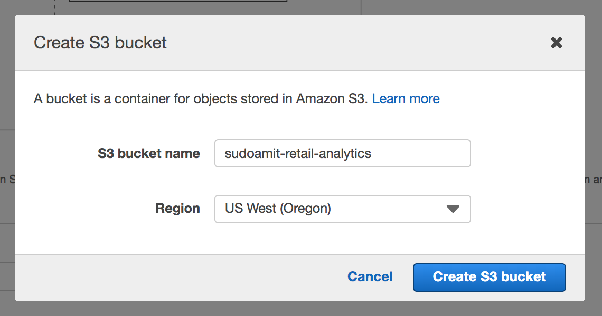
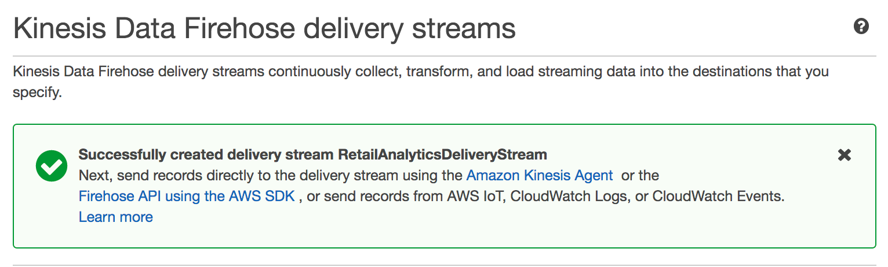

# Lab 2 - Store & Analyze Ingested Data

In this lab, we will store ingested data in Amazon S3 using Amazon Kinesis Data Firehose. We will then crawl this stored data using AWS Glue to discover schema and query this data using Athena.

## 

#### Step A

We will now store the ingested data, now with it's associated anomaly scores along with explanations for historical records and analysis.

1. Click on the 'Destination' tab, and then click on 'Connect to a destination'. We will create a 'Firehose' destination.

   
   
2. For 'Destination', choose 'Kinesis Firehose delivery stream'

3. And for 'Kinesis Firehose delivery stream', click on 'Create new'. This will open up a new tab in which we will create and configure a new Kinesis Firehose delivery stream.

      
   
4. Create a Kinesis Firehose stream. Enter a descriptive name for 'Delivery stream name' and click 'Create'

   

5. In this screen, scroll down to the 'Convert record format' section. For 'Record format conversion' choose the 'Enabled' option.

6. In this screen, we will create an S3 bucket to store ingested data. You may need to scroll down a bit and then click on 'Create new'

   

7. All S3 bucket names, regardless who created them, need to be globally unique. Something string that is unique to you appended to ```retail_analytics``` should help. For example ```retail_analytics_by_amit_at_yahoo_dot_com``` has a very high likelyhood of being unique. 

   

5. Click 'Next'

6. Under 'S3 buffer conditions', for 'Buffer size' enter 100. And for 'Buffer interval' enter 300

   
   
7. Scroll further down on that screen until you see the 'Permissions' section. Click on 'Create new or choose'. This will open up the AWS IAM service in a new browser tab which will pre-populate a role with the required permissions policy. 

8. Click 'Allow'. This will close the IAM browser tab leaving you back in the Firehose Delivery Stream console. 

9. Click 'Next'

10. Click 'Create delivery stream'

11. If all is successful, you should see a Success flash message box.

    


 
