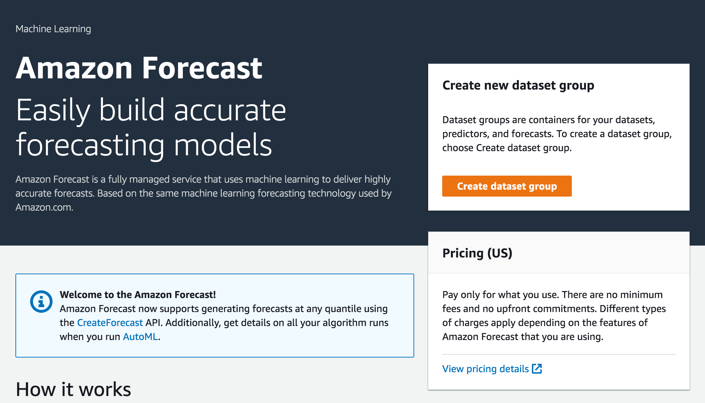
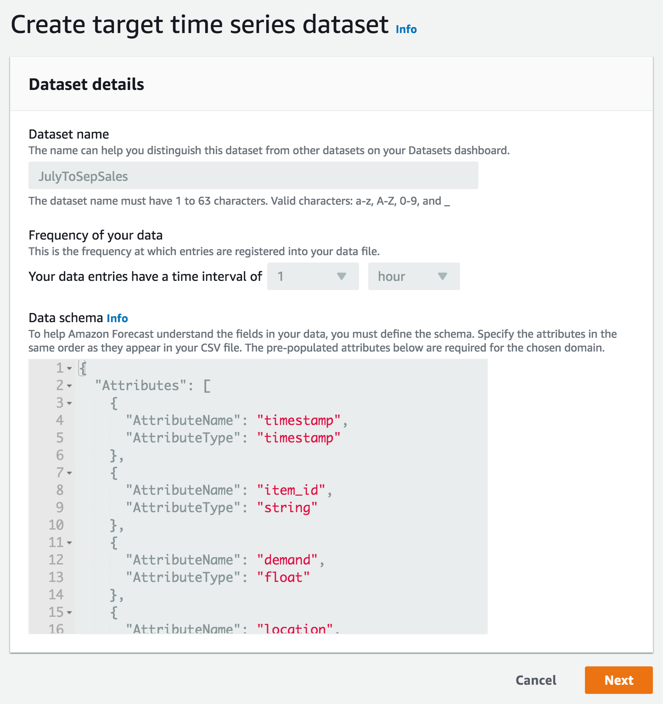
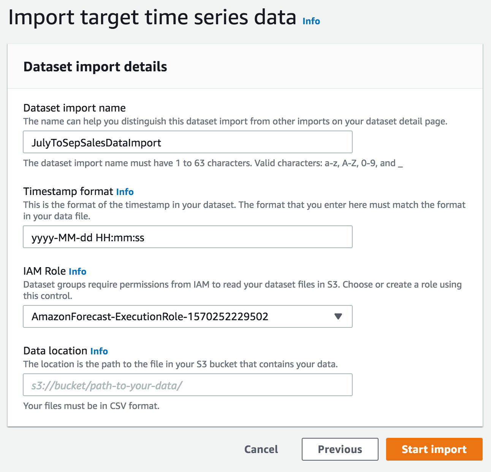
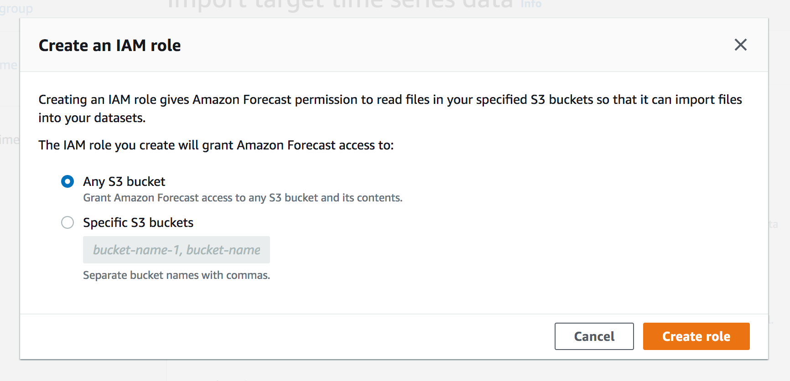
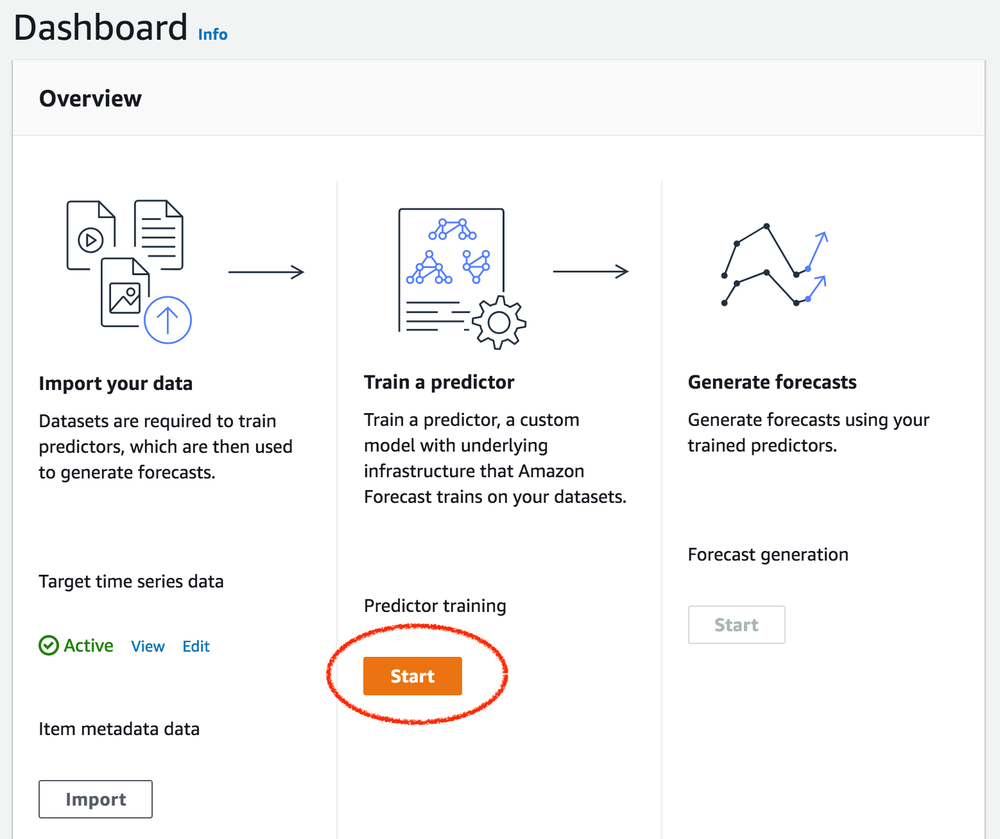
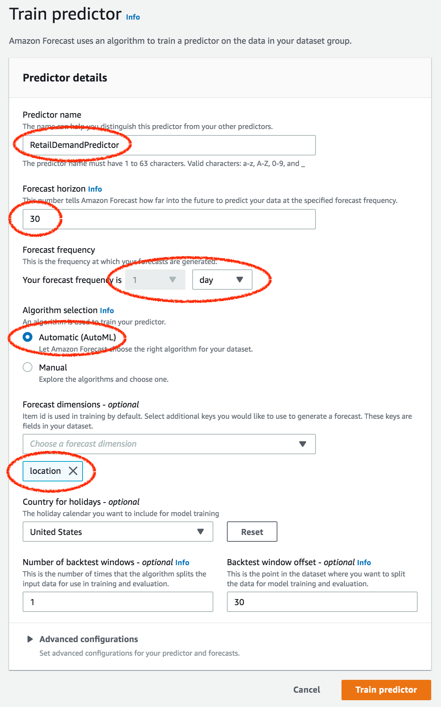
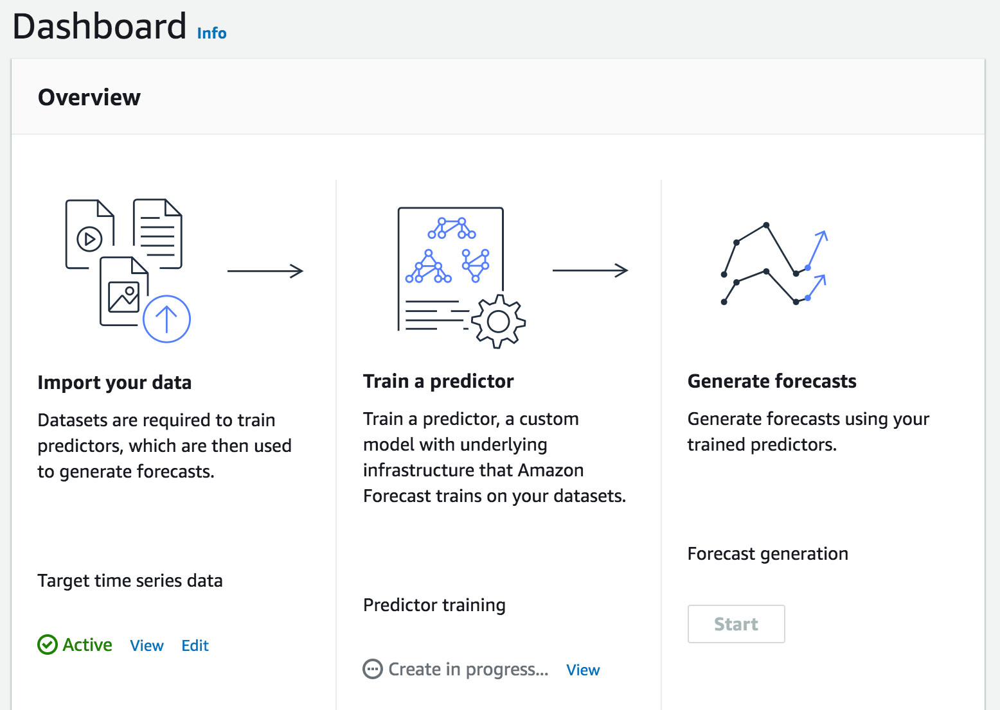
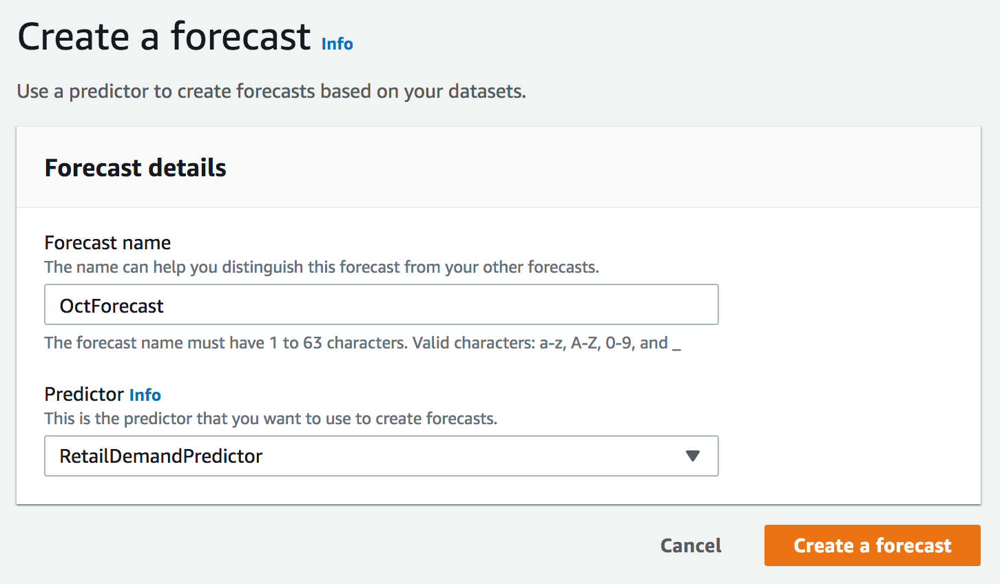
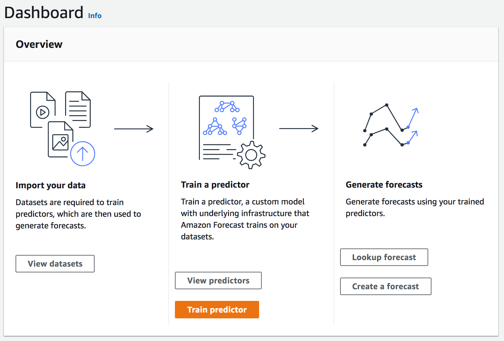
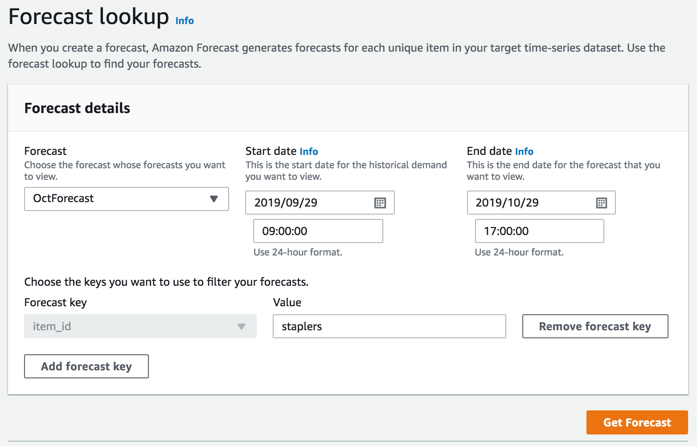

# Lab 3 -- Forecast

In this lab, we will use aggregated retail analytics to forecast future sales. 

| Outside of this workshop setting, you would have already setup infrastructure for ingestion, processing, analyzing, and storing data. And you'd have data that is readily available. |  
|---|

But to make it easy, for workshop purposes, we will simulate aggregated retail analytics data. This simulated data set is aggregated hourly and, for convenience, is included in the file ```retail_analytics.csv```. It looks something like below.

## Simulated Sample Data (aggregated hourly)

Time                | Item     | Quantity | StoreLocation
--------------------|----------|----------|--------------
2019-07-01 09:00:00 | staplers |       38 | San Francisco
2019-07-01 10:00:00 | post-its |       30 | New York
...                 |      ... |      ... |  ...
2019-07-01 14:00:00 | markers  |       29 | Los Angeles

## Forecast

As of this writing, Amazon Forecast is supported in 6 regions. Feel free to choose a region of your choice, but please do ensure that you **always** remain within your chosen region, since you won't be able to see the models and predictors you created in one region from another region. 

Below are the supported regions:

Region Name              | Region 
-------------------------|--------
US East (Ohio)           | us-east-2
US East (N. Virginia)    | us-east-1
US West (Oregon)         | us-west-2
Asia Pacific (Singapore) |	ap-southeast-1
Asia Pacific (Tokyo)     | ap-northeast-1
EU (Ireland)             | eu-west-1

For the purposes of this lab, we're using US West (Oregon), which you may see in a few screenshots. This is displayed as "Oregon" in the top right-hand corner of the AWS console and is referred to as ```us-west-2``` when using the CLI or API.

### Step A

1. In the same browser window that you have the Cloud9 IDE open, open up a new browser tab and point it to https://console.aws.amazon.com/forecast. On the top right-hand corner of the console, note the region you're in. This will typically look like this:

   
   
2. Click on 'Create dataset group'

   

2. We'll first give this dataset group a name. Against 'Dataset group name' enter something descriptive.

3. For 'Forecasting domain', choose 'Retail'.

4. Click 'Next'.

   

### Step B

Now we'll create and define the schema the dataset that we'll base forecasts on. The RETAIL domain supports 3 dataset types, TARGET\_TIME\_SERIES, RELATED\_TIME\_SERIES, and ITEM\_METADATA.

TARGT\_TIME\_SERIES is the **core** dataset that has the feature (column) whose value we're trying to forecast. The other two are **optional** and can help add peripheral information (weather, color, etc.) for more accurate forecasts.

1. Enter a name for the dataset against 'Dataset Name'. For example ```JulyToSeptemberSales```.

2. For 'Frequency of your data' dropdowns, leave the first at '1' and choose 'hour' for the second.

3. For 'Data schema', copy and paste the below:
   
   This schema matches the aggregated dataset we generated in ```retail_analytics.csv```.    

    ```json
    {
    	"Attributes": [
    		{
    			"AttributeName": "timestamp",
    			"AttributeType": "timestamp"
    		},
    		{
    			"AttributeName": "item_id",
    			"AttributeType": "string"
    		},
    		{
    			"AttributeName": "demand",
    			"AttributeType": "float"
    		},
    		{
    			"AttributeName": "location",
    			"AttributeType": "string"
    		}
    	]
    }
    ```

   
4. Now click 'Next'.   

   


### Step C

We will now import data target timeseries dataset that we just defined

1. Before we import the target timeseries dataset, we'll need to upload the ```retail_analytics.csv``` to an Amazon S3 bucket that Amazon Forecast can access and get the dataset from.

2. Switch your browser tab back to the one where you have Cloud9 open.


3. All S3 bucket names, regardless who created them, need to be globally unique. So choose something *unique to you* and append or prepend it to ```retail-forecast``` such as ```sudoamit-retail-forecast```.

   From the Cloud9 terminal window run the below after replacing BUCKET_NAME with some unique name that you came up with for your S3 bucket. 
   
   
   ```shell
   cd lab3_forecast/src
   ```
      
   ```shell
   aws s3 mb s3://[SOME_UNIQUE_NAME]-retail-forecast
   ```
   
   ```shell
   aws s3 cp retail_analytics.csv s3://[SOME_UNIQUE_NAME]-retail-forecast/
   ```
   
   <br/> 
    
2. Switch back to the browser tab where you have Amazon Forecast open to pick up where we left off. The console should now be in the 'Import target time series dataset' screen.     

3. Enter a descriptive name for 'Dataset import name'.

4. Leave the 'Timestamp format' as-is.
 
   


5. For 'IAM Role', click on drop-down and choose

   
   
6. Click on 'Create role'

      


6. For 'Data location' copy and paste the S3 bucket name that you created earlier like so: ```s3://[SOME_UNIQUE_NAME]-retail-forecast/retail_analytics.csv```

   


7. Click on 'Start Import'. If all is successful, you should see a flash message like so:

   

   This should take around 2 mins. Refresh the browser a few times to see if it is complete.

### Step D

We'll now train a Predictor on this dataset that we just imported.


1. Click on 'Start' under 'Train a predictor' (in the middle column)

   
   
2. Enter something descriptive for 'Predictor name'
 
3. For 'Forecast horizon' enter 30 days (we'll attempt to predict demand over the next 30 days)

4. For 'Forecast frequency' enter '1' in the first drop down and 'day' in the second. Our forecast frequency will be daily.

5. For 'Algorithm selection', choose the 'Automatic' option. Amazon Forecast will make the best decision and choose among the available forecasting algorithms. 

   Forecast supports 5 algorithms, ARIMA, DeepAR+, ETS, NPTS, and Prophet. You can read more about these algorithms here https://docs.aws.amazon.com/forecast/latest/dg/aws-forecast-choosing-recipes.html

6. For 'Forecast dimensions', click the drop-down and choose 'Location'

   
   
   The final choices should have the Train predictor screen looking something like this:

      

   
7. Click on 'Train Predictor'. If all succeeds, you will see a screen that shows training is in progress

   
   

### Recap   
   
This training step can take a while, at least 20 - 30mins, so we are going to jump from here to Lab 1.

Just to recap, what we've done so far is:

* Simulated an aggregated retail analytics dataset.
* Copied this dataset to an S3 bucket.
* Imported this dataset into Forecast
* And launched a job to train a predictor on this data.

At this point, we'll jump to [Lab 1](../../lab1_ingest_and_detect_anomalies/instructions/lab1_ingest_and_detect_anomalies.md) and pick this thread back up when the training is done.
   

   
### Step E   

Once the predictor is trained, we'll generate forecasts.


1. Click on 'Start' under 'Generate forecasts'

   


2. Enter a descriptive name against 'Forecast name' 


3. For the 'Predictor' drop-down, choose the predictor that we just trained in the previous step.


4. Click on 'Create a Forecast'

   
   
5. If successful, there should be a flash message like below. 

   


 
   
| This step, though shorter than training a predictor, should still take around 10 to 15mins. Given the time required for this step to complete, Let's jump to Lab 2 and pick this back up when complete.|
|---|


### Step F

1. After the forecast generation is complete, we can look up lookup forecasts for specific items. Click on 'Lookup Forecast'

   

2. In the 'Forecast lookup' screen, enter a name for the 'Forecast'

3. We'll do our 30 day forecast from Sep 29 thru Oct 29. So, for the 'Start date', enter 2019/09/29 as the date and 09:00:00 as time

4. For the 'End date', enter 2019/10/29 as the date and 17:00:00 as the time.

5. For 'Forecast key', ```item_id``` should have already been chosen by default (required by default, since this is what we're forecasting)

6. For 'Value', enter 'staplers'

7. Click on 'Get Forecast'

   
   
8. You should subsequently see a graph with P90, P50, and P10 forecasts like so

      

| Results Explained: The P10, P50, and P90 forecast values represent 10%, 50%, and 90% probability of satisfying the actual demand. The P50 forecast value come is expected to come in closest to what the actual demand should be. |
|---|

---


## Running the Code <span style="color:red;">(OPTIONAL)</color>

While you can directly use the pre-generated ```retail_analytics.csv``` file to generate forecasts, you can also modify the ```retail_pos_simulator.rb``` Ruby script (or  ```retail_pos_simulator.py``` in Python)  that generates this file and modify it to generate a new ```retail_analytics.csv``` file to see differences in forecast based on changes you made. 

To run this code:

cd into the ```lab3_forecast``` directory

```shell
$ cd retail/lab3_forecast
```

install bundler (which is used to install ruby dependencies)

```shell
$ gem install bundler
```

then install dependencies

```shell
$ bundle install
```

and run the script like so...

```shell
$ ruby retail_pos_simulator.rb
```


<style>
    body {
        background-color: #fafafa;
    }

    img {
        box-shadow:inset 0 1px 0 rgba(255,255,255,.6), 0 16px 30px 7px rgba(0,0,0,0.56), 0 0 0 0 rgba(0, 0, 0, 0.3);
        padding: 3px 5px;
        margin: 18px 0 44px;
        text-align: center;
        max-width: 80%;
        display: block;
        margin-left: auto;
        margin-right: auto;
    }

    table {
        overflow: auto;
        display: block;
    }
</style>
