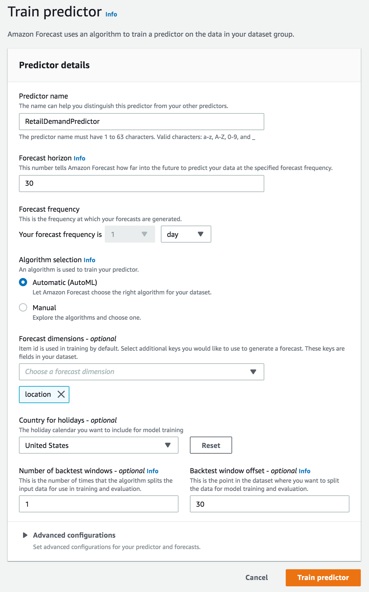
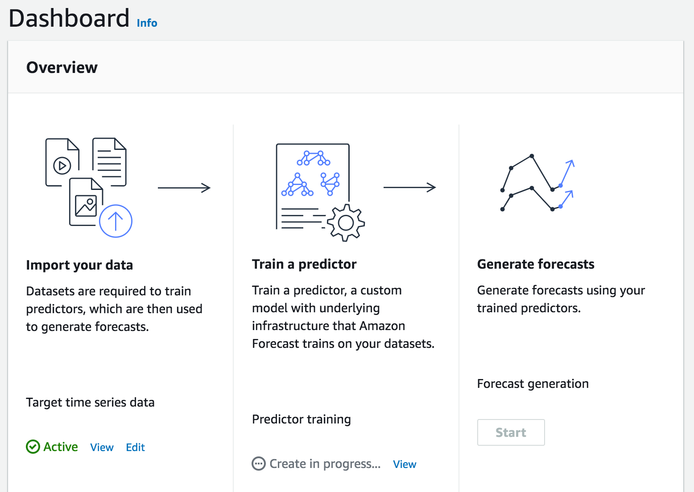

# Lab 3 -- Forecasting

In this lab, we use aggregated retail analytics to forecast future sales. To make this easy, for lab purposes, we will simulate aggregated retail analytics data. This simulated data set is aggregated hourly and included in the file ```retail_analytics.csv``` for convenience and looks something like below.

## Simulated Sample Data (aggregated hourly)

Time                | Item     | Quantity | StoreLocation
--------------------|----------|----------|--------------
2019-07-01 09:00:00 | staplers |       38 | San Francisco
2019-07-01 10:00:00 | post-its |       30 | New York
...                 |      ... |      ... |  ...
2019-07-01 14:00:00 | markers  |       29 | Los Angeles

## Forecast

As of this writing, Amazon Forecast is supported in 6 regions. Feel free to choose a region of your choice, but please do ensure that you **always** remain within your chosen region, since you won't be able to see the models and predictors you created in one region from another region.

Below are the supported regions:

Region Name              | Region 
-------------------------|--------
US East (Ohio)           | us-east-2
US East (N. Virginia)    | us-east-1
US West (Oregon)         | us-west-2
Asia Pacific (Singapore) |	ap-southeast-1
Asia Pacific (Tokyo)     | ap-northeast-1
EU (Ireland)             | eu-west-1

For the purposes of this lab, we're using US West (Oregon), which you may see in a few screenshots. This is displayed as "Oregon" in the top right-hand corner of the AWS console and is referred to as us-west-2 when invoking the CLI or API.

### Console / GUI Steps

#### Step A

1. Point your browser to https://console.aws.amazon.com/forecast. On the top right-hand corner of the console, note the region you're in. This will typically look like this:

   

2. We'll first give this dataset group a name. Against 'Dataset group name' enter something descriptive.

3. For 'Forecasting domain', choose 'Retail'.

4. Click 'Next'.

   

#### Step B

Now we'll create and define the schema the dataset that we'll base forecasts on. The RETAIL domain supports 3 dataset types, TARGET\_TIME\_SERIES, RELATED\_TIME\_SERIES, and ITEM\_METADATA

1. Enter a name for the dataset against 'Dataset Name'. For example ```JulyToSeptemberSales```.

2. For 'Frequency of your data' dropdowns, leave the first at '1' and choose 'hour' for the second.

3. For 'Data schema', enter the below:

    ```json
    {
    	"Attributes": [
    		{
    			"AttributeName": "timestamp",
    			"AttributeType": "timestamp"
    		},
    		{
    			"AttributeName": "item_id",
    			"AttributeType": "string"
    		},
    		{
    			"AttributeName": "demand",
    			"AttributeType": "float"
    		},
    		{
    			"AttributeName": "location",
    			"AttributeType": "string"
    		}
    	]
    }
    ```

   This schema needs to match the schema of the dataset generated by the ```gen_aggregate_pos_data.rb``` script in ```retail_analytics.csv```.    
   
4. Now click 'Next'.   

   


#### Step C

We will now import data target timeseries dataset that we just defined

1. Before we import the target timeseries dataset, we'll need to upload the ```retail_analytics.csv``` to an Amazon S3 bucket that Amazon Forecast can access and get the dataset from.

   From the command line run the below after replacing BUCKET_NAME with the name of your S3 bucket:
      
   ```shell
   aws s3 mb s3://[BUCKET_NAME]
   ```
   
   ```shell
   aws s3 cp retail_analytics.csv s3://[BUCKET_NAME]/
   ```
   
   | TODO: For a new account, user may not have permissions to create S3 buckets. Fix |
| --- |

   
2. Switch back to the AWS console to pick up where we left off. The console should now be in the 'Import target time series dataset' screen.     

   
   
3. Enter a descriptive name for 'Dataset import name'.

4. Leave the 'Timestamp format' exactly as-is.

5. Choose 'IAM Role' 

   | TODO: User may need to create IAM Role. Check and fix. |
| --- |

6. For 'Data location' copy and paste the S3 bucket name that you created earlier like so: ```s3://[BUCKET_NAME]/retail_analytics.csv```

7. Click on 'Start Import'. If all is successful, you should see a flash message like so:

   


#### Step D

We'll now train a Predictor on this dataset that we just imported.


1. Click on 'Start' under 'Train a predictor' (in the middle column)

   
   
2. Enter something descriptive for 'Predictor name'

      
 
3. For 'Forecast horizon' enter 30 days (we'll attempt to predict demand over the next 30 days)

4. For 'Forecast frequency' enter '1' in the first drop down and 'day' in the second. Our forecast frequency will be daily.

5. For 'Algorithm selection, choose the 'Automatic' option. Amazon Forecast will make the best decision and choose among the available forecasting algorithms. 
   
7. Click on 'Train Predictor'. If all succeeds, you will see a screen that shows training is in progress

   
   
   This training step can take a while, at least 20 - 30mins. We'll jump to Lab 1 and pick this up when done.
   

   
#### Step E   

Once the predictor is trained, we'll generate forecasts.


1. Click on 'Start' under 'Generate forecasts'

   


2. Enter a descriptive name against 'Forecast name' 


3. For the 'Predictor' drop-down, choose the predictor that we just trained in the previous step.


4. Click on 'Create a Forecast'

   
   
5. If successful, there should be a flash message like below. 

   

   This step also takes around 10mins, but is shorter than than training a predictor. Let's jump to Lab 2 and pick this up then.


#### Step F

1. After the forecast generation is complete, we can look up lookup forecasts for specific items. Click on 'Lookup Forecast'

   

2. In the 'Forecast lookup' screen, enter a name for the 'Forecast'

3. We'll do our 30 day forecast from Sep 29 thru Oct 29. So, for the 'Start date', enter 2019/09/29 as the date and 09:00:00 as time

4. For the 'End date', enter 2019/10/29 as the date and 17:00:00 as the time.

5. For 'Forecast key', ```item_id``` should have already been chosen by default (required by default, since this is what we're forecasting)

6. For 'Value', enter 'staplers'

7. Click on 'Get Forecast'

   
   
8. You should subsequently see a graph with P90, P50, and P10 forecasts like so

      

---


## Running the Code <span style="color:red;">(OPTIONAL)</color>

While you can directly use the pre-generated ```retail_analytics.csv``` file to generate forecasts, you can also modify the ```retail_pos_simulator.rb``` script that generates this file and modify it to generate a new ```retail_analytics.csv``` file to see differences in forecast based on changes you made. 

To run this code:

cd into the ```3_forecast``` directory

```shell
$ cd retail/3_forecast
```

install bundler (which is used to install ruby dependencies)

```shell
$ gem install bundler
```

then install dependencies

```shell
$ bundle install
```

and run the script like so...

```shell
$ ruby retail_pos_simulator.rb
```


<style>
    img {
        box-shadow:inset 0 1px 0 rgba(255,255,255,.6), 0 16px 30px 7px rgba(0,0,0,0.56), 0 0 0 0 rgba(0, 0, 0, 0.3);
        padding: 3px 5px;
        margin: 18px 0 44px;
        text-align: center;
        max-width: 80%;
        display: block;
        margin-left: auto;
        margin-right: auto;
    }

    table {
        overflow: auto;
        display: block;
    }
</style>
