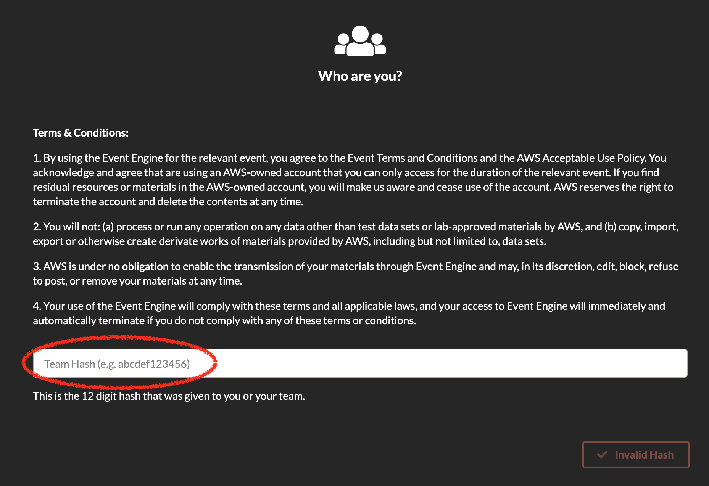
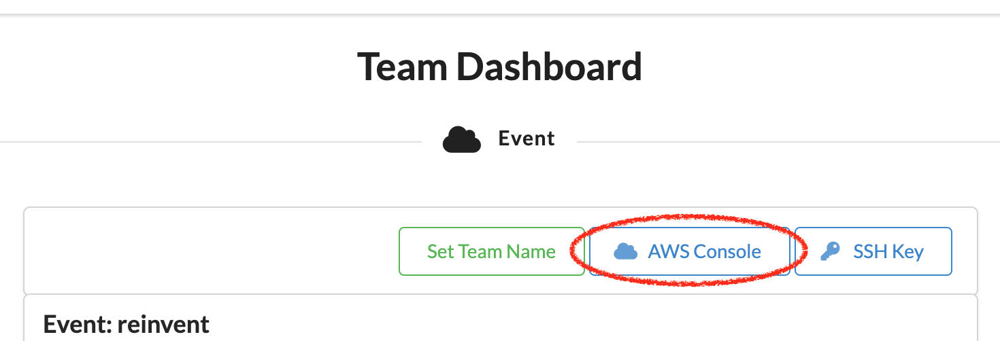
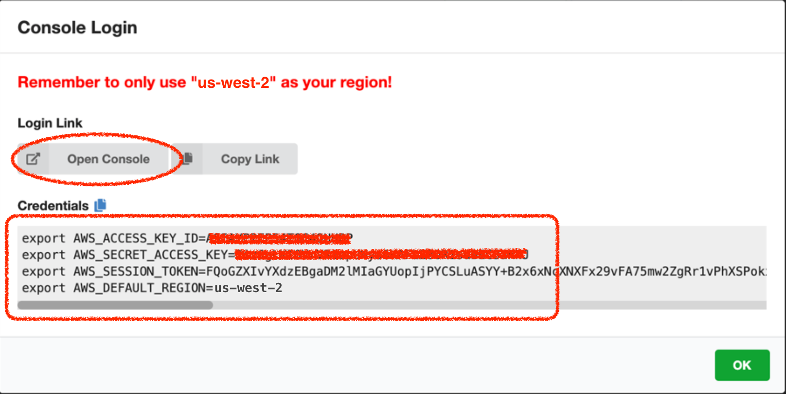

# Retail Analytics Workshop

In this workshop, we will build an end-to-end pipeline that 

* ingests data from PoS systems (simulated) as transactions happen,
* derive near-realtime insights (such as detecting anomalies),
* annotate ingested data with additional information (such as weather or other), 
* store this data for long term records and historical analysis, and
* forecast future demand armed with this data.

## Workshop Setup

### Event Engine

We will use the purpose-built Event Engine to provision free AWS accounts that you can use for the duration of this workshop.

Head over to https://dashboard.eventengine.run.

1. Enter your participant hash and go to the next screen

   
   
2. Click on 'AWS Console'

   
   
3. Copy-paste the Credential values into a Notepad so you have them for later. Specifically,
   * ```AWS_ACCESS_KEY_ID```
   * ```AWS_SECRET_ACCESS_KEY```
   * ```AWS_SESSION_TOKEN```

   We will refer to these interchangeably as ```AWS_ACCESS_KEY_ID``` or ```ACCESS_KEY_ID```. And as ```AWS_SECRET_ACCESS_KEY``` or ```SECRET_ACCESS_KEY```. And as ```AWS_SESSION_TOKEN``` or ```SESSION_TOKEN```.

      


### Regions

As of this writing, Amazon Forecast is supported in 6 regions (below), **but the accounts provided in this Workshop default to Oregon.**

| <p style="color: #e57222;">Note</p> If you're using your own account, it is still recommended to use `us-west-2` (script in lab1 uses `us-west-2`), but if you're confident of replacing `us-west-2` in the script with the region of your preference, feel free to choose any of the supported regions below.|
|---|

As a recommendation, use the free AWS account provided to you for this workshop and then perhaps work thru' the labs *again* in your own AWS account after this workshop to reinforce. The lab instructions will remain online for some time.

The free AWS accounts, however, are only for the duration of this workshop and will be shutdown shortly after. 

Region Name              | Region 
-------------------------|--------
US East (Ohio)           | us-east-2
US East (N. Virginia)    | us-east-1
US West (Oregon)         | us-west-2
Asia Pacific (Singapore) |	ap-southeast-1
Asia Pacific (Tokyo)     | ap-northeast-1
EU (Ireland)             | eu-west-1

### Create Cloud9 Environment 


We will use a Cloud9 environment, which should have all of the most popular languages (Ruby, Python, NodeJS, Java, etc.) and many associated libraries already installed, to help save time and serve as a launch pad.


1. Point your browser to https://console.aws.amazon.com/cloud9

2. From the top right-hand corner, choose one of the 6 regions above.

2. Click on 'Create environment'

   
   
3. For 'Name', enter a something descriptive like 'Retail_IDE' 

4. Click 'Next step'

   
   
5. Leave the 'Environment type' default option chosen as 'Create a new instance for environment (EC2)'

6. For 'Instance type' choose 't2.small (2 GiB RAM + 1 vCPU)

   
   
7. Leave the 'Platform' option (chosen by default) at 'Amazon Linux' 

8. For 'Cost-saving setting', choose 'AFter four hours'

9. Click 'Next Step'

             

   
10. In the final configuration screen, scroll down and click 'Create environment'

    
    
11. It will take about a minute for the Cloud9 environment to be created.

### Customize Cloud9 IDE [OPTIONAL]

12. If you prefer dark themes, click on the settings gear icon in the top right hand corner to open up the preferences pane and choose one of the available dark themes.

    
    

### Clone the Repo

1. In the Cloud9 IDE bash terminal run

```shell
git clone https://github.com/amitnarayanan/retail.git
```


## Labs

Once you've setup your Cloud9 environment, you can start off working thru' each of the labs below.

## Order of Labs

| <p style="color: #e57222;">Note</p> Given that 1. training Amazon Forecast predictors and 2. generating forecasts, each takes significant time (around 40 and 25 mins each), we're going to shuffle the order of the labs and start off with Lab 3. And work thru' other labs, during the training of predictors and then again during generation of forecasts.|
|---|


Of course, in a typical production scenario, the order would be: ingest -> process -> store -> analyze -> and forecast. 


So, hit up Lab 3 in the link below first. We've added cues after each of the two time-consuming steps in Lab 3, so you'll know when to switch to other labs to allow those steps to finish in the background.


### [Lab 1 -- Ingest and Detect Anomalies](lab1/instructions/lab1.md)

Or manually open ```lab1/instructions/lab_1.md```

### [Lab 2 -- Store and Analyze](lab2/instructions/lab2.md)

Or manually open ```lab2/instructions/lab2.md```

### [Lab 3 -- Forecast](lab3/instructions/lab3.md)

Or manually open ```lab3/instructions/lab3.md```


---
*[Ignore anything the below this, including any `<style>` directives]*

<style>
    body {
        background-color: #fafafa;
    }

    img {
        box-shadow:inset 0 1px 0 rgba(255,255,255,.6), 0 16px 30px 7px rgba(0,0,0,0.56), 0 0 0 0 rgba(0, 0, 0, 0.3);
        padding: 3px 5px;
        margin: 18px 0 44px;
        text-align: center;
        max-width: 80%;
        display: block;
        margin-left: auto;
        margin-right: auto;
    }
    
    table {
        overflow: auto;
        display: block;
    }
</style>
