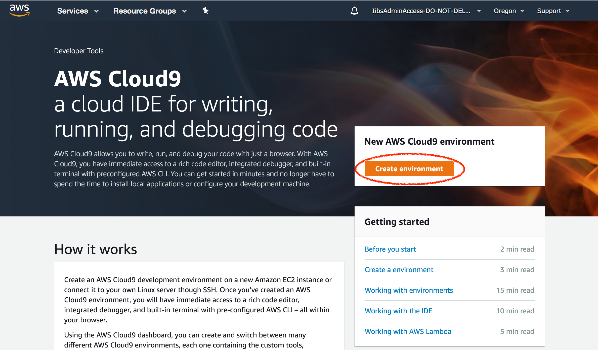
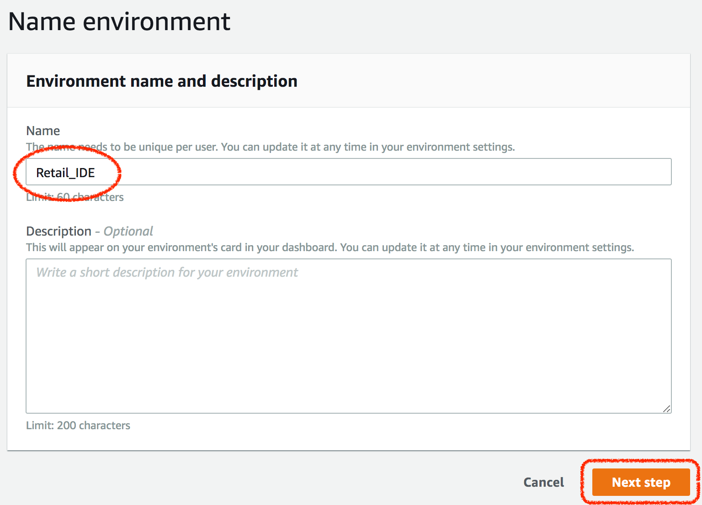
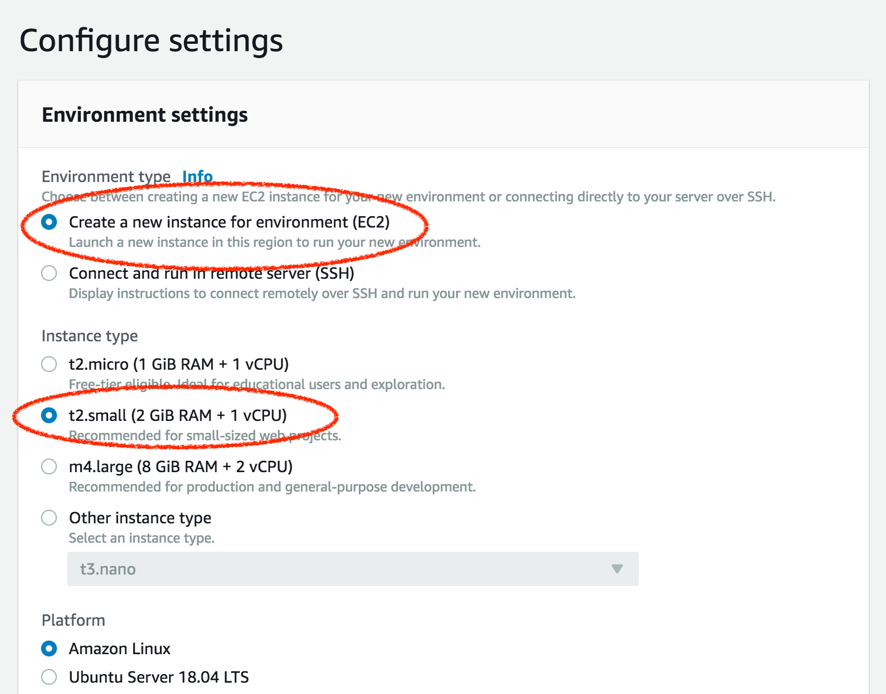
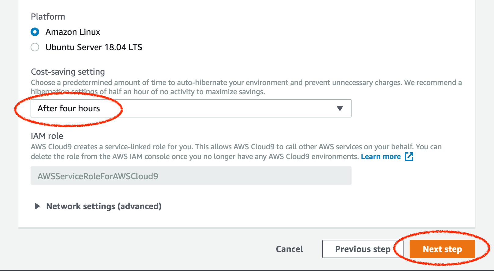
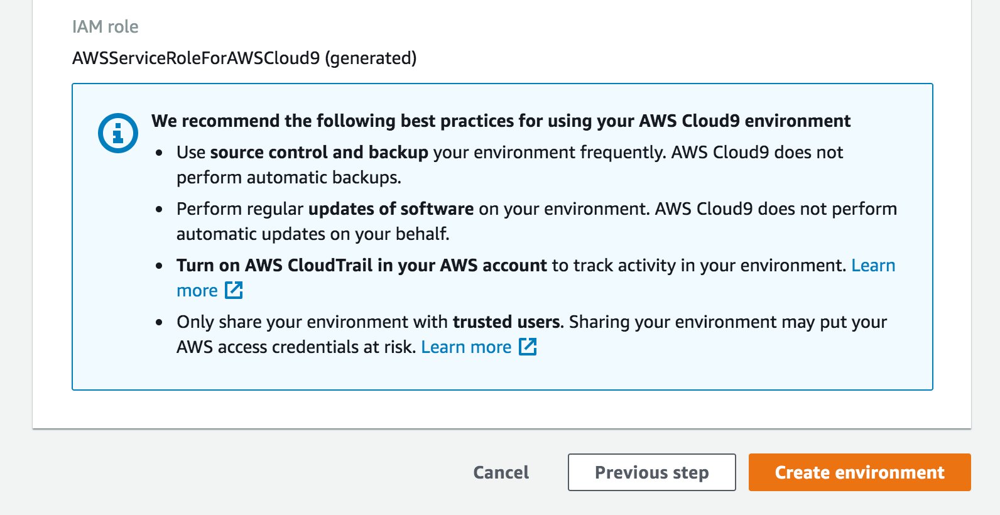
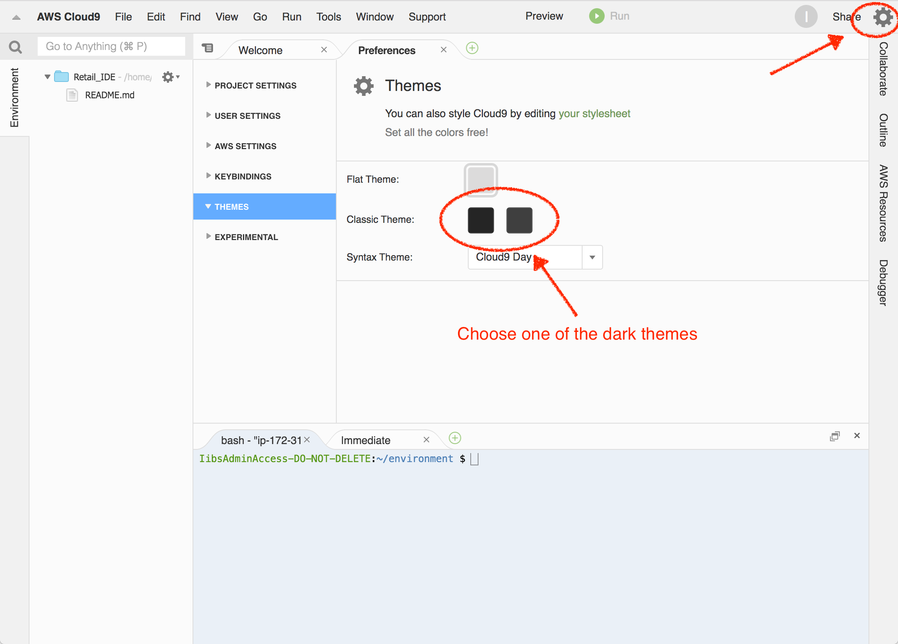

# Retail Analytics Workshop

In this workshop, we will build an end-to-end pipeline that 

* ingests data from PoS systems (simulated) as transactions happen,
* derive near-realtime insights (such as detecting anomalies),
* annotate ingested data with additional information (such as weather or other), 
* store this data for long term records and historical analysis, and
* forecast future demand armed with this data.

## Workshop Setup

We will use a Cloud9 environment, which should have all of the most popular languages (Ruby, Python, NodeJS, Java, etc.) and many associated libraries already installed, to help save time and serve as a launch pad.

### Regions

As of this writing, Amazon Forecast is supported in 6 regions. 

Feel free to choose any region among these 6, but please do ensure that you **always** remain within your chosen region.

Below are the supported regions:

Region Name              | Region 
-------------------------|--------
US East (Ohio)           | us-east-2
US East (N. Virginia)    | us-east-1
US West (Oregon)         | us-west-2
Asia Pacific (Singapore) |	ap-southeast-1
Asia Pacific (Tokyo)     | ap-northeast-1
EU (Ireland)             | eu-west-1

### Create Cloud9 Environment 

1. Point your browser to https://console.aws.amazon.com/cloud9

2. From the top right-hand corner, choose one of the 6 regions above.

2. Click on 'Create environment'

   
   
3. For 'Name', enter a something descriptive like 'Retail_IDE' 

4. Click 'Next step'

   
   
5. Leave the 'Environment type' default option chosen as 'Create a new instance for environment (EC2)'

6. For 'Instance type' choose 't2.small (2 GiB RAM + 1 vCPU)

   
   
7. Leave the 'Platform' option (chosen by default) at 'Amazon Linux' 

8. For 'Cost-saving setting', choose 'AFter four hours'

9. Click 'Next Step'

             

   
10. In the final configuration screen, scroll down and click 'Create environment'

    
    
11. It will take about a minute for the Cloud9 environment to be created.

### Customize Cloud9 IDE [OPTIONAL]

12. If you prefer dark themes, click on the settings gear icon in the top right hand corner to open up the preferences pane and choose one of the available dark themes.

    
    

### Clone the Repo

1. In the Cloud9 IDE bash terminal run

```shell
git clone https://github.com/amitnarayanan/retail.git
```


## Labs

Once you've setup your Cloud9 environment, you can start off working thru' each of the labs below.

## Order of Labs

The labs have been laid out in (chrono)logical order, since, typically you'd ingest -> process -> store -> analyze -> and forecast.

Given that 1. training Amazon Forecast predictors and 2. generating forecasts, each takes significant time (around 40 and 25 mins each), we're going to shuffle the order of the labs and start off with Lab 3. And work thru' other labs, during the training of predictors and then again during generation of forecasts.

So hit up Lab 3 in the link below first. We've added cues after each of the two time-consuming steps in Lab 3, so you'll know when to switch to other labs.


### [Lab 1 -- Ingest and Detect Anomalies](lab1_ingest_and_detect_anomalies/instructions/lab1_ingest_and_detect_anomalies.md)

### [Lab 2 -- Analyze and Visualize](lab2_analyze_and_visualize/instructions/lab2_analyze_and_visualize.md)

### [Lab 3 -- Forecast](lab3_forecast/instructions/lab3_forecast.md)


---


<style>
    body {
        background-color: #fafafa;
    }

    img {
        box-shadow:inset 0 1px 0 rgba(255,255,255,.6), 0 16px 30px 7px rgba(0,0,0,0.56), 0 0 0 0 rgba(0, 0, 0, 0.3);
        padding: 3px 5px;
        margin: 18px 0 44px;
        text-align: center;
        max-width: 80%;
        display: block;
        margin-left: auto;
        margin-right: auto;
    }
    
    table {
        overflow: auto;
        display: block;
    }
</style>
